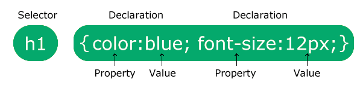
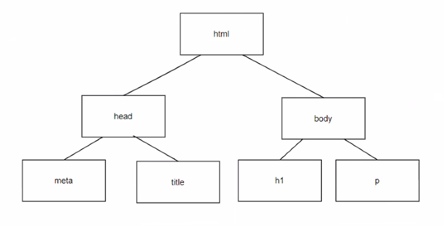
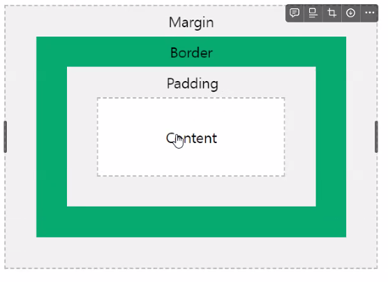

<style>
.markdown-body .callout.callout_warn {
  --text: #6a737d;  // theme text color default
  --title: inherit; // theme title color (falls back to text color by default)
  --background: #f8f8f9;
  --border: #8b939c;
}
</style>
# CSS (Cascading Style Sheets)

: 웹 문서에서 스타일 (크기, 색상, 모양, 위치 등)을 꾸며주는 언어.

## css syntax (css의 구성)



```css
ex) 
선택자 {
  속성1: 속성1의 값;
  속성2: 속성2의 값;
}
```
# css를 적용하는 3가지 방법
```html
<!DOCTYPE html>
<html lang="ko">
  <head>
    <meta charset="UTF-8" />
    <meta name="viewport" content="width=device-width, initial-scale=1.0" />
    <title>Hello, CSS!</title>
    <link rel="stylesheet" href="../../css/main.css" />
    <style>
      p {
        color: blueviolet;
        font-size: 32px;
        text-align: center;
      }
    </style>
  </head>
  <body>
    <h1>CSS를 기술하는 3가지 방법</h1>
    <p>Hello, CSS!</p>
    <p>1. 외부 스타일(css) 파일을 링크하여 사용한다.</p>
    <p>2. 내부 style태그를 이용하여 적용</p>
    <p style="color: red;">3. inline 방식을 이용하여 적용</p>
    <div>div태그</div>
  </body>
</html>
```

- main.css
```css
@import url(mycss.css);
p {
  border: 1px dotted blue;
}

```
- mycss.css
```css
div {
  background-color: aqua;
}
```

## (4) class 선택자 <br>
- 태그 내부에 class속성을 이용합니다.
- 동일한 값으로 여러 태그를 선택할 수 있는 선택자
- 가장 많이 사용하는 선택자이다.

```html
<!DOCTYPE html>
<html lang="ko">
<head>
  <meta charset="UTF-8">
  <meta name="viewport" content="width=device-width, initial-scale=1.0">
  <title>class 선택자</title>
  <style>
    .bg {
      background-color: salmon;
    }
    .accent {
      border: 1px dashed #000;
      padding: 5px;
      color: white;
    }
  </style>
</head>
<body>
  <h1 class="bg accent">class 선택자</h1>
  <p class="">태그의 내부에 class속성을 이용합니다.</p>
  <p class="bg">동일한 값으로 여러 태그를 선택할 수 있는 선택자</p>
  <p class="">가장 많이 사용되는 선택이다.</p>
</body>
</html>
```

## (5) 그룹 선택자

```html
<!DOCTYPE html>
<html lang="ko">
<head>
  <meta charset="UTF-8">
  <meta name="viewport" content="width=device-width, initial-scale=1.0">
  <title>그룹 선택자</title>
  <style>
    h1, p {
      text-align: center;
    }

    p {
      color: blue;
    }
  </style>
</head>
<body>
  <h1>group 선택자</h1>
  <p>선택자를 이용해 같은 스타일을 여러태그에 적용가능하다.</p>
</body>
</html>
```

# DOM (Document Object Management) 구조



# 4. CSS 복합 선택자
```html
<!DOCTYPE html>
<html lang="ko">
<head>
    <meta charset="UTF-8">
    <meta name="viewport" content="width=device-width, initial-scale=1.0">
    <title>복합 선택자</title>
    <style>
        span.carrot {
            color: orange;
        }
        
        /* div.carrot {
            color: red;
        } */

        
    </style>
</head>
<body>
    <div>
        <ul>
            <li>사과</li>
            <li>블루베리</li>
            <li class="carrot">오렌지</li>
        </ul>
        <div>수박</div>
        <p>토마토</p>
        <span class="carrot">당근</span>
    </div>
</body>
</html>
```

## (2) 자손 (하위)선택자
:부모 요소에 포함된 자손(하위) 요소를 모두 선택한다.
```html
<!DOCTYPE html>
<html lang="ko">
<head>
  <meta charset="UTF-8">
  <meta name="viewport" content="width=device-width, initial-scale=1.0">
  <title>자손 선택자</title>
  <style>
    .secondDiv p {
      background-color: pink;
    }
    
    div p {
      background-color: pink;
     }
     
    div p {
      background-color: blue;
      color: white;
    }
  </style>
</head>
<body>
  <h1>자손 선택자</h1>
  <p>자손 선택자로 스타일을 꾸미면 어떻게 될까요?</p>
  <div>
    <p>div 내부 p태그</p>
    <p>div 내부 p태그</p>
    <p>div 내부 p태그</p>
  </div>
  <p>div 외부 p태그</p>
  <div class="secondDiv">
    <p>2번째 div 내부 p태그</p>
    <p>2번째 div 내부 p태그</p>
    <p>2번째 div 내부 p태그</p>
  </div>

</body>
</html>
```

# (3) 자식 선택자 (Child Selector)
: 자식 요소에만 스타일을 적용하는 선택자
'>' 기호를 이용해 자식요소를 구분한다.
```html
부모요소>자식요소
<!DOCTYPE html>
<html lang="ko">
<head>
  <meta charset="UTF-8">
  <meta name="viewport" content="width=device-width, initial-scale=1.0">
  <title>자식 선택자</title>
  <style>
    /* 자손 선택자 */
    div p {
      background-color: red;
    }
    
    /* 자식 선택자 */
    div>p {
      background-color: aqua;;
    }

    h3>p {
      background-color: blue;
    }
  </style>
</head>
<body>
  <h1>자식 선택자</h1>
  <p>자식 선택자로 스타일을 꾸미면 어떻게 될까요?</p>
  <div>
    <p>div 내부 p태그(div의 자식)</p>
    <p>div 내부 p태그(div의 자식)</p>
    <p>div 내부 p태그(div의 자식)</p>
  <h2>
    <p>div 내부의 내부 p태그(h2의 자식, div의 자손)</p>
  </h2>
  <h3>
    <p>div 내부의 내부 p태그 (h3의 자식, div의 자손)</p>
  </h3>
</div>
<p>
  div 외부의 p태그
</p>
</body>
</html>
```
# (4) 형제 Sibling (동위 또는 이웃) 선택자
Sibling Selector는 선택한 태그 이후에 나오는 모든 형제 (동위) 요소 선택
```html
요소1 ~ 요소2
```
```html
<style>
      div ~ p {
        background-color: yellow;
      }
    </style>
  </head>
  <body>
    <h1>Sibling 선택자</h1>
    <p>Sibling 선택자로 스타일을 꾸미면 어떻게 될까요?</p>
    <p>걍</p>
    <div>
      <p>div 내부 p태그 (div의 자식)</p>
      <p>div 내부 p태그 (div의 자식)</p>
      <p>div 내부 p태그 (div의 자식)</p>
    </div>
    <p>div 외부 p태그1</p>
    <p>div 외부 p태그2</p>
    <p>div 외부 p태그3</p>
    <div>
      <p>div 내부 p태그 (div의 자식)</p>
      <p>div 내부 p태그 (div의 자식)</p>
      <p>div 내부 p태그 (div의 자식)</p>
    </div>
    <p>div 외부 p태그1</p>
    <p>div 외부 p태그2</p>
    <p>div 외부 p태그3</p>
```

# (5) 인접 형제 선택자 (adjacent sibling selector)
```
형제1 + 형제2 {
  ...
}
```

```html
<style>
    h1 + p {
      background-color: violet;
    }
  </style>
</head>
<body>
  <h1>Adjacent Sibling 선택자</h1>
    <p>Adjacent Sibling 선택자로 스타일을 꾸미면 어떻게 될까요?</p>
    <div>
      <p>div 내부 p태그 (div의 자식)</p>
      <p>div 내부 p태그 (div의 자식)</p>
      <p>div 내부 p태그 (div의 자식)</p>
    </div>
    <p>div 외부 p태그1</p>
    <p>div 외부 p태그2</p>
    <p>div 외부 p태그3</p>
```

**_정리:_**<br>
```
* 자손 선택자 : 부모 자손
* 자식 선택자 : 부모 > 자식
* 형제 선택자 : 형제1 ~ 형제2
* 인접 형제 선택자 : 형제1 + 형제2</i>
```
# (7) 가상 클래스 선택자 (Psuedo Class Selector)
* 선택자에 추가하는 키워드로 요소 상태에 따라 반응하도록 만든 클래스
* 사용자의 동작에 반응하도록 만든 가상 클래스 (ex: hover, active, focus 등)
* 특정 위치에 있는 요소 선택하도록 만든 클래스 (ex:nth-child(even짝수,odd홀수,숫자))
```html
<style>
    /*     
    :link  (방문하지 않은 링크에 스타일 적용)
    :visited (방문한 링크에 스타일 적용)
    :hover (특정 요소에 마우스 포인터를 올렸을 때 스타일 적용)
    :active (특정 요소에 클릭하는 순간 스타일 적용)
    :focus (웹 요소에 초점이 맞춰졌을 때 스타일 적용) 
    */
    .box { 
      width: 100px;
      height: 100px;
      background-color: blue;
      transition: 3s;
    }
    
    .box:hover { 
      width: 300px;
      background-color: yellowgreen;
    }

    input:focus {
      background-color: gray;
      
    }

    a:visited {
      /* 방문했던 페이지 */
      color: red;
      text-decoration: none;
    }
    li:hover {
      /* li요소에마우스 포인터를 올리면 */
      background-color: yellow;
    }

    a:active {
      color: rgb(38, 0, 255)
    }
  </style>
</head>
<body>
  <div class="box"></div>
  <div><input type="text"></div>
  <h1>Web Front 기술</h1>
  <ul>
    <li><a href="https://developer.mozilla.org/ko/docs/Learn/HTML/Introduction_to_HTML/Getting_started">HTML</a></li>
    <li><a href="https://developer.mozilla.org/ko/docs/Learn/Getting_started_with_the_web/CSS_basics">CSS</a></li>
    <li><a href="https://developer.mozilla.org/ko/docs/Web/JavaScript">JAVASCRIPT</a></li>
    <li><a href="https://jquery.com/">jQuery</a></li>
    <li><a href="https://ko.wikipedia.org/wiki/Ajax">ajax</a></li>
  </ul>
```


예제) <br>
테이블을 생성후, 각 행이 교차해서 줄무늬처럼 색상을 적용시키기

```html
<!DOCTYPE html>
<html lang="ko">
<head>
  <meta charset="UTF-8">
  <meta name="viewport" content="width=device-width, initial-scale=1.0">
  <title>테이블을 생성후 줄무늬 색상 적용하기</title>
  <style>
    table tr:nth-child(2n) {
      background-color: rgb(107, 107, 107);
    }

    table tr:nth-child(2n+1) {
      background-color: rgb(166, 180, 180);
    }
  </style>
</head>
<body>
  <table>
    <tr>
      <td>HTML</td>
    </tr>
    <tr>
      <td>JAVASCRIPT</td>
    </tr>
    <tr>
      <td>VUE</td>
    </tr>
    <tr>
      <td>ANGULAR</td>
    </tr>
    <tr>
      <td>REACT</td>
    </tr>
  </table>
</body>
</html>
```


# (8) 가상 요소 선택자 (psuedo element selector)


# (9) 속성 선택자 (Attribute Selector)
: 태그가 가지고 있는 속성이나 속성의 값을 이용해서 선택하는 선택자
```
태그명[속성] { 
  ...
}
```
```html
<style>
a[href] {
      /* a태그의 href 속성이 있는 요소에 스타일 적용 */
      background-color: yellow;
    }
  </style>
</head>
<body>
  <ul>
    <li><a>메인 메뉴 : </a></li>
    <li><a href="#">메뉴1</a></li>
    <li><a href="#">메뉴2</a></li>
    <li><a href="#">메뉴3</a></li>
    <li><a href="#">메뉴4</a></li>
  </ul>
</body>
```

|   종류  |        선택요소       |                   예                         |
|---------|----------------------|----------------------------------------------|
|[속성]|해당 속성이 있는 요소를 선택|a[href]                                       |
|[속성]=값|지정한 속성값이 있는 요소|a[target="_blank"]                            |
|[속성~=값]|지정한 속성 값이 포함된 요소 (단어별)|[class~="button"]                 |
|[속성&#124;=값]|지정한 속성 값이 포함된 요소 (값-하이픈포함, 단어별)|[class&#124;=ch]|
|[속성*=값]|지정한 속성 값의 일부가 일치하는 요소|a[href*="wiki"]                   |
|[속성^=값]|지정한 속성 값으로 시작하는 요소|[title^="eng"]                         |
|[속성$=값]|지정한 속성 값으로 끝나는 요소|[title$="se"]                            |


# 5. 텍스트 관련 스타일
글자 모양을 결정하는 스타일 속성
1) font-family: 글꼴 변경
font-family: 글꼴이름1, 글꼴이름2, 글꼴이름3...

2) font-size: 글꼴 사이즈 
    - 절대단위: px 픽셀, pt 포인트
    - 상대단위: 
      - %: (백분율)
      - em: (요소의 글꼴 크기 - 부모 요소에서 지정한 글꼴의 대문자 의 너비를 기준으로(1em)한 후 비율값을 지정)
      - rem: root(부모)에서 지정한 크기를 기준으로 (1rem)한 후 비율 값을 지정
      - vw: 뷰포트 가포 너비의 백분율
      - vh: 뷰포트 세로 너비의 백분율 

  3) font-style: normal | italic | olbique 
  4) font-weight: normal | bold | bolder | 100 200 ~ 900 (글자의 굵기)
  5) color: 색상명 | #16진수(#000000 ~ #ffffff) | rgba(r,g,b, alpha(불투명도))<br>
  16진수를 가장 보편적으로 사용 (색상추출: ColorZilla 확장프로그램)
  6) text-align(가로 정렬): left | right | center | justify(양쪽정렬)
  7) line-height(줄간격): 2.5(글자크기의 2.5배 줄간격) <br>
  -> 세로 중앙 정렬에 이용 : 글자를 둘러싸고 있는 영역의 height를 line-height값과 똑같이 지정
  8) text-decoration: 텍스트의 줄을 표시하거나 없애준다.
  <br> none | underline | overline | line-through(가운데줄)
  9) text-shadow: 텍스트의 그림자 효과<br>
  가로px, 세로px, 번짐정도, 색상
  10) text-transform: 영문자를 표기할 때 대문자 또는 소문자를 표시한다.<br>
  capitalize | uppercase | lowercase
  11) letter-spacing(글자 간격), word-spacing(단어 간격)
<br>

# 6) 목록 태그와 함께 사용하는 스타일 속성
list-style-type : none; 리스트의 bullet 제거

### Box Model
: 하타의 태그(요소)가 차지하는 크기는 아래 그림과 같이 컨텐츠 영역 + padding 영역 + Border + Margin 영역의 합으로 그려진다. 
<br><br>


## (1) Box-sizing
: 박스 모델에 따라 박스의 크기를 계산할 때 지정하는 방식
- box-sizing : border-box : 테두리 (border)영역 까지의 박스 크기를 width 값으로 크기를 설정 가능하다.
- box-sizing : content-box : 컨텐츠 영역만 width 값으로 크기를 설정한다.

## (2) Box-shadow
: box에 그림자 효과를 주는 속성
- box-shadow : 수평거리 수직거리 흐림정도 번짐정도 색상

## (3) max-width
: 태그가 가질 수 있는 최대 가로크기

<pre>
태그에 max-width를 이용하여 가로 크기를 지정하면, 그 태그가 가질 수 있는 최대 크기가 그 값으로 되며, 만약 브라우저의 가로 사이즈가 줄어들면 비율로 함께 요소의 크기도 줄어준다. <br>(스크롤바가 생기지 않는다)
(max-height도 있다.)
</pre>

## (4) min-width
: 태그가 가질 수 있는 최소 가로크기 __(가로 스크롤 바가 생긴다.)__
<pre>
min-width: 400px;
-> 웹 브라우저의 가로크기가 400px 이상일 때, 블럭요소의 특성(width:100%)을 가져 유동적으로 크기가 반응되지만, 최소 너비보다 웹 브라우저의 가로크기가 작아지면 가로 스크롤 바가 생긴다.
(min-height도 있다.)
</pre>

## 연습문제)
이력서 양식을 테이블을 이용해서 만들어보세요 (월요일 9시 30분까지)
<a href="https://yhs99.github.io/goott/csspractice/homework">숙제 링크</a>

# 7. postion
: 요소를 화면의 원하는 곳에 배치하려 할때 요소의 <strong>기준위치를 잡아주는</strong> 속성

  1) static: 문서의 흐름에 맞춰 배치(기본 값)
  2) relative: 자기 위치를 기준으로 배치
  3) absolute: relative를 기준으로 한 상위 요소를 기준으로 위치를 지정해 배치.
  4) fixed: 브라우저 창을 기준으로 지정해 배치.
  5) sticky

# 8. z-index
요소의 쌓이는 순서(stack) <br>
:어떤 요소가 사용자가 보는 방향에 더 가깝게 쌓이는지 결정
  1.  요소에 postion 속성의 값이 있는 경우 위에 쌓인다. (postion: static 제외)
  2. 1번 조건이 같으면, z-index 속성으 숫자가 높을수록 위에 배치된다.
  3. 1번과 2번 조건이 같으면, html의 가장 마지막에 작성한 요소가 위로 표시된다.


# 9. overflow 
<details>
<summary>35_overflow.html</summary>
<!DOCTYPE html>
<html lang="ko">
<head>
  <meta charset="UTF-8">
  <meta name="viewport" content="width=device-width, initial-scale=1.0">
  <title>Overflow 속성</title>
  <style>
    div.overflow {
      width: 200px;
      height: 200px;
      background-color: cadetblue;
      overflow: auto;
      text-overflow: ellipsis;
    }
    div.ellipse {
      width: 200px;
      height: 200px;
      background-color: aqua;
      overflow: hidden;
      text-overflow: ellipsis;
      white-space: pre;
    }
  </style>
</head>
<body>
  <div class="overflow">
    Lorem, ipsum dolor sit amet consectetur adipisicing elit. Voluptatibus adipisci recusandae nihil excepturi obcaecati ut quo consectetur, debitis ab. Doloribus minima quibusdam esse natus obcaecati asperiores eos veniam ad tempora.
    Lorem ipsum dolor sit amet consectetur adipisicing elit. Expedita, iure tempore quidem esse praesentium culpa vel maxime, repellendus veritatis, qui explicabo numquam. Maxime non optio maiores dolorem, sequi sunt accusamus?
  </div>
  <div class="ellipse">
    Lorem ipsum dolor, sit amet consectetur adipisicing elit. Doloremque voluptatibus perspiciatis accusantium quidem ipsum dolores doloribus totam tempora atque dolore dolor molestiae impedit vel, delectus, iusto accusamus ipsa cum alias.
    Lorem ipsum dolor sit amet consectetur adipisicing elit. Veniam, quisquam aspernatur. Nihil enim dolore id? Ipsum itaque, praesentium blanditiis vero nulla iusto, distinctio culpa sit, molestias delectus voluptatum harum quam!
  </div>
</body>
</html>
</details>

