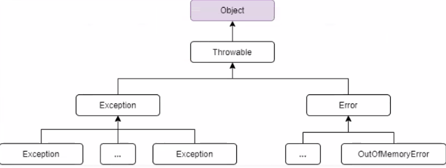
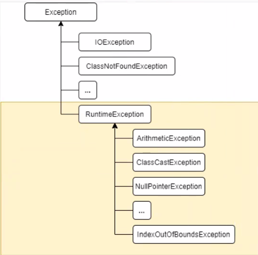
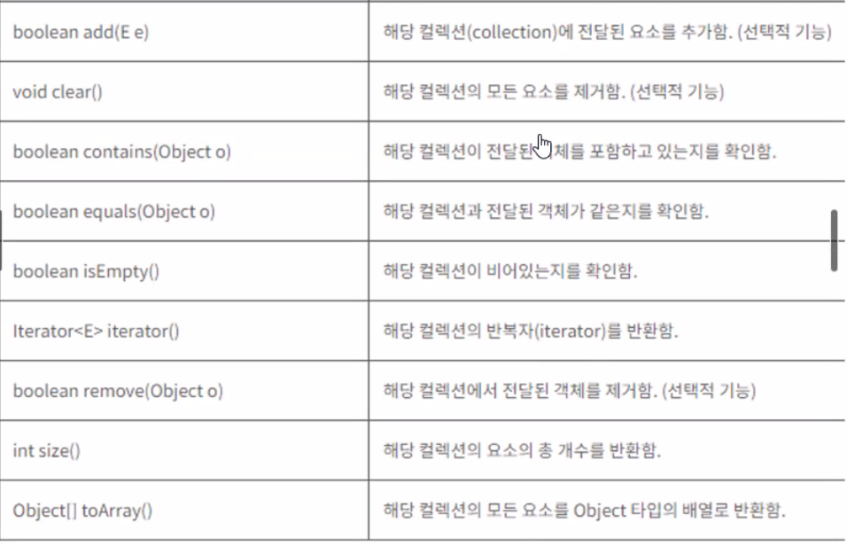
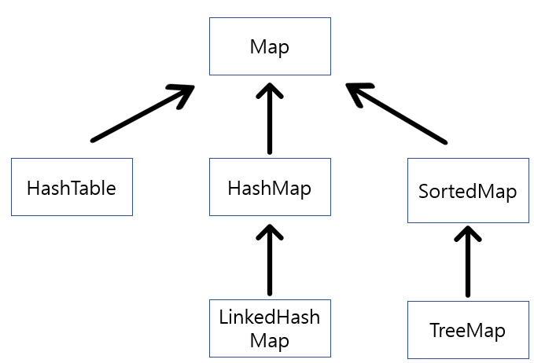

- [JAVA 1. 설치](#java-01-자바-설치)
- [JAVA 2. 자바 언어의 특징](#java-02-자바-언어의-특징)
- [JAVA 3. 자바 언어의 특징](#java-03-변수와-데이터-타입)
- [JAVA 4. 자바 배열](#java-04-배열-array)
- [JAVA 5. 자바 객체지향 프로그래밍 p.1](#java-05-객체지향-프로그래밍-part1)
- [JAVA 5. 자바 객체지향 프로그래밍 p.2](#java-05-객체지향-프로그래밍-part2)
- [JAVA 6. 예외처리 (Exception)](#java-06-예외처리-exception)

# Java 01. 자바 설치
<pre>
  1. JDK1.8 (Java Development Kit) and JVM (Java Virtual Machine) 설치
  <a href="https://www.azul.com/core-post-download/?endpoint=zulu&uuid=957bbb55-37c3-445a-8529-7ca115dfe708">다운로드</a>
  2. 환경 변수 설정 (어느 경로에서나 java.exe가 실행되도록 설정) : zulu jdk는 자동으로 설정해줌.

  3. IDE : Eclipse, JAVA EE Mode
  <a href="https://www.eclipse.org/downloads/download.php?file=/oomph/epp/2024-06/R/eclipse-inst-jre-win64.exe&mirror_id=1248">다운로드</a>
</pre>

- Oracle JDK vs openJDK

# Java 02. 자바 언어의 특징
  자바는 썬 마이크로시스템에서 개발하여 1996년에 발표한 객체지향 프로그래밍 언어이다.

  1) 운영체제에 독립적이다.
  자바 가상 머신(JVM)만 설치되어 있다면, 어느 플랫폼(맥, OS, 리눅스 등)에서나 동작한다.

  2) 객체지향 언어이다. 상속, 캡슐화, 다형성 등 객체지향 언어의 특징이 잘 적용된 프로그래밍 언어로 손꼽힌다.

  3) 배우기 쉽다 - C Fmaily언어

  4) 자동 메모리 관리가 된다. 가비지컬렉터.
  5) 멀티스레드 지원

## 3. 자바 프로그램의 실행 과정
: 자바는 컴파일 방식의 프로그래밍 언어이다.
<pre>소스코드(.java) --<small>컴파일</small>-> 바이트코드파일(.class) -> 실행</pre>

JDK - 자바개발도구 (Java Development Kit)<br>
JRE - 자바 실행환경 (Java Runtime Environment) : 자바로 작성된 응용프로그램이 실행되기 위한 환경<br>
JVM - 자바가상머신 OS에 구애받지않고 독립적으로 자바를 실행할 수 있게 해준다.


# Java 03. 변수와 데이터 타입
  1) 변수 : 하나의 값을 저장할 수 있는 메모리번지에 붙여진 이름.

```java
int score; // 변수  선언
score = 90; // 값 대입(할당)
```


## 변수, 메서드, 클래스등의 이름을 만드는 규칙
  1. 대소문자가 구분되며, 길이 제한은 없다. (True, true)
  2. 예약어를 사용할 수 없다
  3. 숫자로 시작할 수 없다.(첫번째 글자는 문자여야 한다.)
  4. 중간부터는 문자, 숫자, 특수문자(_, $만 가능)을 포함할 수 있다.
  5. 클래스의 첫 글자는 항상 대문자로 한다.
  6. 변수와 메서드의 첫글자는 소문자로 시작한다.
  7. 상수의 이름은 모두 대문자로 한다. 여러 단어로 이루어져있으면 _로 구분한다.
  8. camel 표기법을 따르는 것이 좋고, 변수 또는 메서드 또는 클래스 이름은 목적이 분명하게 이름을 짓는것이 좋다.

## 2) 데이터 타입 (Data Type)
  ### 1) 값타입 | 기본형 (primitive type) - 총 8개
    자바에서 기본으로 만들어놓은 데이터 타입이며, 메모리의 스택(stack)영역에 만들어진다. 크기도 고정되어 있다.


✨✨✨✨✨✨✨✨
|  |1 byte | 2 byte | 4 byte | 8 byte |
|---|-------|--------|--------|--------|
|논리형|boolean(Boolean)|               |        |
|문자형|     |char(Character)    |        |        |
|정수형|byte(Byte) |short(Short)   |*int(Integer)    |long(Long)    |
|실수형|     |        |float(Float)   |*double(Double)  |
*:기본 데이터타입
<hr><br>
  - 논리형 : boolean(true | false)
  - 문자형 (char) : 문자를 저장하는데 사용되고, 변수에 하나의 문자만 저장할 수 있다. 문자를 내부적으로 정수(유니코드 - 2byte)로 저장하기 때문에 정수형 또는 실수형과 연산도 가능하다.

  - 위 표에서 괄호안에 있는 문자는 자바 wrapper 클래스이다. java.lang 패키지에 포함되어있다.
```
정수형 타입은 리터럴 접미사(L | l)가 붙지않으면 int타입으로 간주한다. 이때, 왜 기본형 타입을 int로 가질까? 이것은 `JVM의 피연산자 스택(operand stack)`이 `피연산자를 4byte단위로 저장`하기 때문에 4byte보다 작은 자료형(byte,short)로 값을 계산하면 4byte로 변환하여 연산을 수행한다. 즉, int자료형을 사용하면 바로 연산을 하지만 4byte보다 작은 자료형을 사용하면 연산을 위해서 다시한번 int형으로 변환하는 연산이 생기게 된다. 따라서, 연산을 수행할때 int보다 작은 자료형을 사용하면 더 비효율적인것이다. 만약, CPU연산보다 메모리를 더 절약하는게 중요한 프로그램이라면 byte,short를 사용해도 된다.  
```

  ### 2) 참조타입 (reference type)
  : 사용자 정의 타입이라고도 한다. 메모리의 힙(heap)영역에 만들어진다.
  크기가 고정되어 있지 않다. (값 타입이 아닌 것 (String, 객체))

# JAVA 04. 배열 (Array)
: <strong>같은 타입</strong>의 여러 변수를 (사용하기 편하게) 하나의 묶음으로 관리<br>
  ## 배열의 선언과 생성
  1) 배열의 변수를 선언한다.
  
  선언|예
  ---|---
  데이터타입[] 변수이름; | int[] scores;
  데이터타입 변수이름[]; | int scores[];

  2) 선언된 배열을 정의(생성)해야 한다.<br>
  scores = new int[배열의크기]; 

  ## 자바스크립트 배열과의 차이점
  - 자바는 배열에 하나의 데이터타입밖에 집어 넣지 못한다. (자바스크립트에서는 모든 기본타입이 배열에 들어갈 수 있다.)
  - 자바의 배열은 동적으로 크기가 고정되어 있다. (자바스크립트에서는 동적으로 배열의 크기를 변환가능)
  
  ## 객체(배열) 복사
  - 참조타입을 복사할 때는 깊은 복사와 얕은 복사 2가지 방법이 있다.
    1) 깊은 복사(deep copy)
     : 객체의 실제 값을 새로운 객체(new 연산자로 만든)로 복사한다.
      - new 연산자를 사용해 새로운 객체를 만드는 것이므로, 원본과 사본의 주소 값이 다르다(다른 객체)
      - 원본의 값을 힙 영역에 복사하기 때문에 참조하고 있는 실제 값이 다르다.
      - 원본의 내용이 수정되더라도 사본에 영향을 끼치지 않는다.

    2) 얕은 복사 (shallow copy)
     : new 연산자를 사용하지 않고, 객체의 주소값만 복사하는 것.
     - 객체의 주소값 만을 복사하기 때문에, 원본과 사본의 주소가 같다
     - 주소값을 복사(스택영역)하기 때문에 실제 값은 같다.
     - 원본의 내용이 수정되면, 사본도 같은 메모리를 참조하기 때문에 영향을 받는다.

# JAVA 05. 객체지향 프로그래밍 part.1
객체지향 프로그래밍(Object Oriented Programming, OOP)<br>
현실 세계의 모든 것을 객체화 시켜 프로그래밍하는 기법으로써, 현실 세계와 유사한 가상 세계를 컴퓨터 속에 구현하려는 노력에 의해 탄생되었다.

## 객체 지향 프로그래밍의 장점
1. 코드의 재사용성이 높다.
2. 코드간의 관리가 용이하다.
3. 신뢰성이 높은 프로그래밍을 가능하게 한다.


## 클래스와 객체
- 클래스 : (정의) 객체를 정의해 놓은 것. 객체를 만들기 위한 틀,설계도, 청사진
- 객체 : (정의) 현실 세계의 모든 것. -> 속성(객체가 가지고 있는 특징, 성질)과 기능(객체가 하는 일)을 가지고 있다.

## 객체와 인스턴스
```
                  인스턴스화 
     (클래스로부터 객체를 생성하는 과정: 메모리 부여)
클래스 ======================================> 인스턴스(객체)
```

## 연습문제
```
Order 클래스
  - prodName (상품명)
  - price (상품가격)
  - quantity (상품수량)

OrderMain 클래스
  출력 = 상품명 : 오라클, 가격 : 20000, 수량 : 2
  출력 = 상품명 : 자바, 가격 : 20000, 수량 : 2
  출력 = 상품명 : 스프링, 가격 : 20000, 수량 : 2
```


## 클래스 생성방법
```Java
[접근제한자] class 클래스이름 {
   //[멤버변수]

   //[멤버메서드]
}
```

## 변수와 메서드
### 변수의 종류

변수의 종류|선언위치|생성/소멸|용도
---------|-------|-------|-----
클래스변수(= static 변수)|클래스 내부 |프로그램이 시작과 동시에 생성되고, 프로그램 종료시 소멸|모든 객체들이 공용으로 사용할 값을 넣음.
인스턴스 변수|클래스 내부|객체가 생성될 때 생성되고, 객체가 소멸|객체마다 다르게 부여할 수 있는 값
지역변수|메서드, 생성자, 초기화블럭 내부 | 블럭{}에서 변수가 선언되었을 때 생성되고, 그 블럭이 끝나면 소멸|

### 메서드 생성법
```Java
[접근제한자] [static] 반환값타입|void 메서드이름 ([매개변수1타입 매개변수1, ...]) {
  // 메서드가 호출되면 실행

  [return 반환값;]
}
// 1. 접근 제한자(access modifier) : 생성된 메서드가 호출될 수 있는 범위를 지정
// public > protected > default(생략시) > private

// 2. static : 프로그램이 실행될 때 메모리에 자동으로 생성되는 메서드
// => 클래스명.멤버변수명 | 클래스명.멤버메서드()로 호출
```

```Java
class Variable {
  int iv; // 인스턴스 변수
  static int cv; // 클래스 변수(정적 변수)

  void method() {
    int lv = 0; // 지역 변수
  }
  
  static void method() {
    iv // << 변수 사용불가
    cv; // 클래스 메서드는 클래스 변수만 사용할 수 있다.
  }
}
```


## 클래스 메소드(static 메소드) vs 인스턴스 메소드
- static 메소드란?
  - 메소드 앞에 static가 붙은 메소드이다.
  - 객체 생성 없이 호출이 가능한 메소드
static 메소드와 인스턴스 메소드의 차이는 인스턴스 변수 사용 유무로 나뉜다.

- 인스턴스 메소드
  - 인스턴스 생성 후, '참조 변수.메소드 명()'으로 호출한다.
  - 인스턴스 멤버와 관련된 작업을 한다.
  - 메소드 내에서 인스턴스 변수를 사용할 수 있다.
  - 인스턴스 변수를 이용해서 작업을 하므로 변수의 묶음인 객체를 생성해야 인스턴스 메소드를 호출할 수 있다.
  
  ex) Exam ex = new Exam(); ex.example = "예시";

- static 메소드(클래스 메소드)
  - 객체 생성 없이 '클래스 명.메소드 명()'으로 호출이 가능하다.
  - 인스턴스 멤버와 관련되지 않은 작업을 한다.
  - 메소드 내에서 인스턴스 변수를 사용할 수 없다.
  - 인스턴스 메소드와 달리 인스턴스 변수가 필요 없으므로 객체를   생성하지 않고도 호출할 수 있다.
  
  ex) Math.random()


## 메서드 오버로딩(Method Overloading) 기법
: 하나의 이름으로 시그니쳐가 다른 메서드를 정의하여 사용하는 기법

### 메서드 오버로딩의 조건
  - 같은 클래스 내에 있어야한다.
  - 메서드 이름이 동일해야 한다.
  - 메서드시그니처(method signature : 파라미터의 순서, 타입, 갯수)가 달라야 한다.
  - 반환값 타입이나 static|non-static은 같지 않아도 된다.

```Java
int add(int a, int b) {
  return a + b;
}

int add(float a, float b) {
  return a + b;
}
```

### 연습문제
- MathArrUtils 클래스 생성.
=> int[]를 매개변수로 받아서, sum(), average(), min(), max(), sort() 기능 및 결과 출력
- MathArrUtils는 객체를 생성하지 않고 사용한다.


## 생성자 (constructor)
```Java
1. 생성자는 클래스 이름과 같아야 한다.
2. 생성자는 반환타입이 없다. (비워두어야 한다. void 생략)
```

생성자 오버로딩과 this() : this()를 사용하면, 생성자 내부에서 다른 생성자를 호출할 수 있다. -> 중복제거

## 생성자 장점
- 중복 호출 제거
- 제약

## 캡슐화 encapsulation (은닉화)
### 접근 제어자 (access modifier)
  | |public | protected | default | private
  |---|-------|------|-----|---------
  범위|다른 패키지에서도 모두 접근 가능|동일한 패키지에서 접근 가능 + 상속받은 클래스|접근제어자를 생략하면 default가 된다. 동일한 패키지 내에서만 접근 가능| 동일한 클래스 내에서만 접근이 가능하다.

### 연습문제
```
1. 
Account 클래스
  멤버변수 : balance (잔액) : 초기값 = 0
  메서드 : deposit(), withdraw(), getBalance() - 어디에서나 접근 가능하도록 만들고,
  금액의 유효성 검사를 해서 유효하지 않으면 콘솔에 유효하지 않음을 알린다.
  isValid()는 금액을 매개변수로 받아서 금액이 음수가 아닌지 검사하고 음수가 아니면 true를 반환하며, 다른 클래스에서 호출하지 못하도록 한다.
```

```Java
2. CartMain 코드가 작동되도록 Book, Cart 클래스를 완성하세요.
  - Book 멤버변수 : 책이름, 가격, 수량
  - Cart 멤버변수 : Book배열, 전체수량
  - 접근제어자를 사용해서 데이터를 캡슐화하세요.
  - 해당 클래스는 다른 패키지에서도 사용할 수 있어야합니다.
  - 카트(장바구니)에는 10개의 책만 담을 수 있습니다.
  10개 초과시 장바구니에는 10개까지만 담을 수 있습니다 출력

CartMain 코드 --
Cart cart = new Cart();
Book book1 = new Book("자바", 20000, 2);
Book book2 = new Book("JSP", 22000, 3);
cart.addBook(book1);
cart.addBook(book2);

cart.displayBooks(); // 장바구니 상품을 출력하고 전체 가격의 총합을 출력한다.
```
```Java
3. Member 클래스 : memberId, memberPwd, memberName, memberAge
memberId = "dooly"
memberPwd = "1234"

MemberService 클래스 : 
로그인 : login(아이디, 비밀번호) -> 
저장값과 같을경우 "로그인 되었습니다."
다르면 "로그인 실패" 출력, boolean 반환

```

### Singleton 싱글톤 패턴
```Java
public class ConnectService {
	// 싱글톤 (Singleton) 패턴
	private static ConnectService cn = new ConnectService();
	
	private ConnectService() {};
	
	public static ConnectService getInstance() {
		return cn;
	}
}
```


# JAVA Stream Class
https://mangkyu.tistory.com/112

[ Stream API의 3가지 단계 ]
 
Stream은 데이터를 처리하기 위해 다양한 연산들을 지원한다. Stream이 제공하는 연산을 이용하면 복잡한 작업들을 간단히 처리 할 수 있는데, 스트림에 대한 연산은 크게 생성하기, 가공하기, 결과만들기 3가지 단계로 나눌 수 있다.

- 생성하기
- 가공하기
- 결과만들기
  

## 생성하기

Stream 객체를 생성하는 단계
Stream은 재사용이 불가능하므로, 닫히면 다시 생성해주어야 한다.

Stream 연산을 하기 위해서는 먼저 Stream 객체를 생성해주어야 한다. 배열, 컬렉션, 임의의 수, 파일 등 거의 모든 것을 가지고 스트림을 생성할 수 있다. 여기서 주의할 점은 연산이 끝나면 Stream이 닫히기 때문에, Stream이 닫혔을 경우 다시 Stream을 생성해야 한다는 것이다.

 
 
## 가공하기

원본의 데이터를 별도의 데이터로 가공하기 위한 중간 연산
연산 결과를 Stream으로 다시 반환하기 때문에 연속해서 중간 연산을 이어갈 수 있다.

가공하기 단계는 원본의 데이터를 별도의 데이터로 가공하기 위한 중간 연산의 단계이다. 어떤 객체의 Stream을 원하는 형태로 처리할 수 있으며, 중간 연산의 반환값은 Stream이기 때문에 필요한 만큼 중간 연산을 연결하여 사용할 수 있다. 
 
 
## 결과 만들기

가공된 데이터로부터 원하는 결과를 만들기 위한 최종 연산
Stream의 요소들을 소모하면서 연산이 수행되기 때문에 1번만 처리가능하다.

[ Stream 연산 예시 코드 ]
```Java
List<String> myList = Arrays.asList("a1", "a2", "b1", "c2", "c1");

myList
    .stream()							// 생성하기
    .filter(s -> s.startsWith("c"))			// 가공하기
    .map(String::toUpperCase)			// 가공하기
    .sorted()							// 가공하기
    .count();							// 결과만들기
``` 


## 제어자
: 제어자는 클래스, 메서드, 또는 변수의 선언부에 함께 사용되어 부가적인 의미를 부여한다 (조합하여 사용)

## 접근제어자
1. public: 다른 패키지에서도 모두 접근 가능
2. protected : 동일한 패키지내에서 접근 가능 + 상속 받은 클래스
3. (default) : 접근 제어자를 생략하면 default가 된다. 동일한 패키지 내에서만 접근 가능
4. private : 동일한 클래스 내에서만 접근 가능

## static - 정적인, 클래스의, 공통적인
: 멤버변수, 메서드, 초기화블럭
제어자|대상|의미
---|---|---
static|멤버변수|모든 인스턴스에 공통적으로 사용되는 클래스 변수가 된다.<br>클래스 변수는 인스턴스를 생성하지 않고 사용.<br> 클래스가 메모리에 로드될 때 생성된다.
||메서드|인스턴스를 생성하지 않고 호출이 가능한 메서드가 된다.<br>(클래스명.정적메서드명)<br>static메서드 내에서는 인스턴스 멤버들을 직접 사용할 수 없다.

## 멤버변수의 초기화
- 명시적 초기화
- 생성자
- 초기화 블럭

클래스 변수 : 기본값 > 명시적 초기화 > 클래스 초기화블럭
인스턴스 변수 : 기본값 > 명시적 초기화 > 인스턴스초기화블럭 > 생성자

## final - 변경 될 수 없음
제어자|대상|의미
---|---|---
final|클래스|변경될 수 없는 클래스, 확장될 수 없는 클래스가 된다.(다른 클래스의 조상(부모)이 될 수 없다.)
||메서드|변경될 수 없는 메서드, final로 지정된 메서드는 오버라이딩이 불가능하다.
||멤버변수,지역변수|변수 앞에 final이 붙으면 값을 변경할 수 없다(상수)

- 상수 : 단 하나만 존재하는 변하지 않는 고정된 값을 갖는 수 
  - static final 붙여서 사용
  - 대문자로 사용하고 ( _ )를 사용하여 단어를 구분한다.

## abstract - 추상의, 미완성의
메서드의 선언부만 작성하고, 실제 수행내용은 구현하지 않은 추상메서드를 선언하는데 사용된다.
그리고 클래스에 사용될 경우 클래스 내에 추상메서드가 존재한다는 것을 알 수도 있다.

## 제어자 조합시 주의점
- 메서드에 static과 abstract는 함께 사용 불가능하다
- 클래스에 abstract와 final는 함께 사용 불가능하다.
- abstract 메서드의 접근제어가 private일 수 없다.
- 메서드에 private과 final을 같이 사용할 필요가 없다.
<br><br><br>

# JAVA 05. 객체지향 프로그래밍 part.2
part2에서는 객체지향 프로그래밍을 해서 얻는 이점이 무엇인지 대해서 공부한다.<br>
클래스간의 관계
: 클래스가 2개 이상일 때, 그 클래스 간의 관계를 파악
1. is-a 관계 : "~은 ~이다" 라고 풀이되는 관계. 상속관계를 구현한다.

2. has-a 관계 : "~은 ~을 가지고 있다" 라고 풀이되는 관계. 포함관계로 구현한다.


## CarDealer
```
포커카드 
- 카드 타입 : 하트, 스페이드, 클로버, 다이아몬드
- 카드 숫자 : A(=1), 2, . . ., 10, J, Q, K
이 포커카드를 처음에 딜러가 개봉하여 (개봉시 순서대로 박스에 들어가 있음) 플레이어에게 섞어서 전달한다고 하자
- 딜러가 개봉할 때의 카드를 모두 출력하고,
- shuffle() 이라는 메서드를 호출하면 카드를 랜덤하게 섞어서, 출력
- pickCard()를 호출하면 딜러가 플레이어에게 카드를 1장 지급한다
  -> 플레이어에게 지급된 카드를 출력

```


## 상속 (inheritance)
클래스간의 2개 이상의 객체가 '~은~이다' 라고 풀이 되면 상속 관계로 구현될 수 있다.<br>
기존 클래스를 사용해서 새로운 클래스를 작성하는 것.
  - 기존 클래스가 가지고 있는 멤버(멤버변수, 멤버상수, 멤버메서드)를 새로운 클래스에게 물려주는 것.
  - 단, 생성자와 초기화 블럭은 상속되지 않는다.

  ```
  조상 클래스 (상속을 주는 클래스)
    - 부모(parent) 클래스, 상위(super)클래스, 기반(base) 클래스
  자손 클래스 (상속을 받는 클래스)
    - 자식(child) 클래스, 하위()클래스, 
  ```

- 상속관계에서, 객체를 생성하면, 자식이 참조하는 메모리 영역에는 부모와 자식이 모두 생성된다.


## 메서드 오버라이딩 (method overriding)
: 부모가 가지고 있는 메서드를 상속 받아 그 메서드를(자신에 맞게) 수정하여 재사용하는 개념

## 메서드 오버라이딩 규칙
- 접근 제어자는 부모의 것보다 범위가 크거나 같아야 한다.
- static / non-static 도 부모의 것과 동일해야 한다.
- 메서드 이름도 부모의 것과 동일해야 한다.
- 반환값 타입도 부모의 것과 동일해야 한다.
- 매개변수 또한 부모의 것과 갯수, 타입, 순서 모두 동일해야 한다.
- 오버라이딩 된 메서드는 부모의 것보다 더 많은 체크예외를 throws로 선언할 수 없다. (더 작거나 같은 수의 예외 또는 하위 타입의 예외는 선언할 수 없다.)
- 생성자는 오버라이딩 할 수 없다.

### super vs this
- super: 부모 객체를 참조
- this: 현재 자기 자신의 객체를 참조


> ✨ 자식 클래스의 생성자에서 부모 클래스의 생성자를 반드시 호출해야 한다.

연습문제1
```Java
Book, Movie, Album
공통 속성 : name, price
- Book : author, isbn
- Movie : director, rate
- Album : artist

출력 :
각 상품의 이름, 가격
각 상품만의 속성 값
총 가격
```
연습문제2
```Java
아래의 조건에 부합하는 클래스(삼각형, 사각형, 원)을 설계하세요.
단, 객체지향 프로그래밍 개념을 이용하여 코드를 최대한 재사용할 수 있도록 합니다.

조건1) 삼각형은 이름과 색상을 가지고 있고, 원점(x,y)과 높이, 밑변이 있고, 화면에 그리는 기능을 가지고 있다.

조건2) 사각형은 이름과 생각을 가지고 있고, 원점(x,y)과 가로,세로가 있고, 화면에 그리는 기능을 가지고 있다.

조건3) 원은 이름과 색상을 가지고 있고, 원점(x,y)과 반지름이 있고 화면에 그리는 기능을 가지고 있다.
```

## 참조변수의 형변환 : Upcasting, Downcasting
서로 상속관계에 있는 클래스 사이에서만 형변환이 가능하다.
- Upcasting : 자손타입 -> 조상타입 (자동형변환, 형변환 생략 가능)
- Downcasting : 조상타입 -> 자손타입 (형변환 생략 불가능)
<br> 주의점 : Upcasting 한 후, Downcasting 해야 한다.


### 연습문제
> 어떤 부서에 2가지 형태의 사원이 근무한다고 하자.<br>
> 모든 사원은 사번, 이름, 소속부서명, 급여를 가지고 있다. <br>
> 정규직 사원에게는 기본급을 지급하고, <br>
> 알바직 사원에게는 시간당 급여 (= 급무시간 * 시급)를 지급한다.<br>
> 다형성과 상속관계를 이용해서 구현하기

# 인터페이스 ( Interface )
```Java
public class Tv {
	
	private String brandName;
	
	Tv(String brandName) {
		this.brandName = brandName;
	}
	
	public void powerOn() {
		System.out.println(brandName + " TV ON");
	}
	
}

public class Remote {

	private Tv tv;
	
	public Remote() {
		this.tv = new Tv("SAMSUNG");
	}

	public void turnOnTv() {
		tv.powerOn();
	}
	
}

public class RemoteMain {
	
	public static void main(String[] args) {
		Remote remote = new Remote();
		remote.turnOnTv();
	}
}
```
### 위 코드의 문제점
1. 리모컨이 TV를 가지고 있다(has-a 관계): has-a관계가 아님에도, 리모컨으로 TV Power를 켜야해서 TV객체를 가지고 있다고 표현함.
2. TV는 리모컨이 없으면 동작할 수 없음. -> 리모컨이 없어지면 TV도 같이 없어진다.
3. TV 클래스를 수정하면 Remote 클래스도 수정해야 한다.
4. 이 리모컨을 TV만 제어 가능하다.

### webhssy.loosecoupling <br>
전자제품(power를 가지고 있는 제품) ElectronicDevice라는 인터페이스를 만들고, 그 인터페이스를 상속받아 Tv,Washer를 구현하였다. 전자제품을 제어할 수 있는 리모컨은 void remoteControl(ElectrnicDevice ed)만 구현하면 리모컨이 되도록 인터페이스를 구현하였다.
<br>
-> 하나의 리모컨은 모든 전자제품을 제어할 수 있게 되었고, Remotable을 상속받은 다른 기기(스마트폰)가 있다면 그 기기도 전자제품을 제어할 수 있도록 구현한 것이다.


# JAVA 06. 예외처리 (Exception)
## 1. 프로그래밍에서의 오류
  1. 컴파일 오류 (compile error) : 실행하기 전에 나는 에러. 보통 프로그래머가 문법을 잘 못 사용하였을 때 나는 오류. 실행되기 전에 디버깅 되어야 하는 오류이다
  2. 런타임 오류(run-time error) : 프로그램이 실행될 때 발생하는 오류(발생할 수도 있고, 안 할 수도 있는 오류)
  3. 논리적 에러 : 작성 의도와 다르게 동작하는 오류
  


## 2. 예외 계층구조




## 3. 예외 처리  구문
### 1) try ~ catch ~ [finally]
```Java
  try{
    //예외 발생 가능성 문장
  }catch(발생 예외 객체1 e) {
    // 발생 예외 객체1 발생시 수행 문장
  }catch(발생 예외 객체2 e) {
    // 발생 예외 객체2 발생시 수행 문장
  }catch(Exception e){ 
    //예외1,2 이외의 모든 예외 발생시 수행 문장
  }[ finally {
    // try catch 이후 무조건 수행할 문장
  } ]
```

## 사용자 정의 예외 클래스
: 자바에서 예외(Exception)으로 정의되진 않았지만, 프로그램 자체에서 어떤 규칙에 따라서 (ex. 음수나 0을 입력하면 예외발생) 프로그래머가 직접 예외클래스를 만들 수 있다.
- 예외 클래스는 보통 Exception 클래스로부터 상속받아 구현 가능하다.
- 만들어진 사용자 정의 예외 클래스를 발생시키고자 할 때 throw구문을 사용한다.

```Java
try {
  throw 발생_시키고싶은_예외객체;
}catch (발생_시킨_예외객체 처리) {
8
}
```

## throws 구문으로 예외 미루기
예외가 발생한 곳이 아닌 예외가 발생된 메서드를 호출한 곳에서 예외를 처리하도록 미루는 문법
```Java
접근제어자 반환타입 메서드명() throws 예외1, 예외2, 예외3 ...{

}
```

## try-with-resource 구문
주로 IO(입출력)와 관려뇐 클래스를 사용할 때 유용하게 쓸 수 있는 구문.
```Java
try(FileInputStream fis = new FileInputStream("경로");
    DataInputStream dis = new DataInputStream(fis)) {

    }catch (IOException e) {
      System.out.println("파일이 없습니다.");
    }
```

# JAVA 07. 컬렉션 (Collection)
: 다수의 데잍터를 쉽게 관리, 처리할 수 있는 표준화된 방법들을 제공하는 클래스들을 묶어서 자바에서는 컬렉션(Collection)이라고 한다.

## 컬렉션 프레임워크의 핵심 인터페이스의 특징
인터페이스|특징|주요 구현 클래스
----|----|----
List|순서가 있는 데이터의 집합, 데이터의 중복 허용|ArrayList, LinkedList, Stack, Vector, Queue 등
Set|순서를 유지 하지 않는 데이터의 집합, 데이터의 중복을 허용하지않음|HashSet, TreeSet(정렬기능) 등
Map|키(key)와 값(value)의 쌍으로 데이터를 관리. 순서는 유지되지 않으며, 키는 중복을 허용하지 않고, 값은 중복을 허용한다.|HashMap, TreeMap, HashTable

## Collection 주요 멤버


## 제네릭스 Genrics
- Generic 타입: 내부에서 사용할 타입을 외부에서 주입하는 것.
- Generic 타입을 사용하는 이유: 컬렉션의 객체들은 그냥 생성하면 raw 타입이되어 Object타입의 데이터를 관리하게 된다. raw타입을 사용하는 것보다 특정 타입을 지정해 주어서 그 타입의 데이터만 관리하는 것이 좋다.
  - Box-Unboxing 의 부하를 줄일 수 있다.
  - 데이터의 안정성 (Type Safety)을 보장하기 때문.

## LinkedList
```
ArrayList vs LinkedList
순차적인 추가, 삭제, 접근은 ArrayList가 더 빠름.
중간에서부터의 추가, 삭제, 접근은 LinkedList가 더 빠름.
```

## Stack
:LIFO(Last In First Out) 후입선출

## Queue
:FIFO(First In First Out) 선입선출


### 주민등록번호 예제
대한민국 국민(Korean)이라는 객체를 Set에 넣어 관리하려고 한다.
- 국민은 주민등록번호와 이름을 가지고 있다.
- 주민등록번호와 이름이 같으면 같은 국민으로 본다.

## ✨ HashSet의 중복비교 방법
Set의 add()메서드가 중복값을 비교하는 방법은 기존 값의 hashCode()값을 비교하고 같은 값이 있다면 equals()를 호출하여 한번 더 비교한다.<br>
객체의 중복을 체크하기 위해선 hashCode와 equals의 메소드를 Override해주어야 한다.
```Java
// 주민등록 번호와 이름이 같을 경우 같은 객체로 판단한다.
@Override
public int hashCode() {
  String identify = this.name + this.regNo;
  return identify.hashCode();
}

@Override
public boolean equals(Object obj) {
  if(obj instanceof Korean) {
    Korean a = (Korean) obj;
    return (a.getName().equals(this.name) && 
        a.getRegNo().equals(this.regNo));
  }
  return false;
}

```

## Comparable vs Comparator
- Comparable 인터페이스 (java.lang 패키지) : 기본 정렬 기준을 구현할 때 사용
- Comparator 인터페이스 (java.utl 패키지) : 기본 정렬 기준 외에 다른 기준으로 구현할 때 사용

## (2) TreeSet
```Java
여러명의 학생이 있다.
학생은 학번, 이름, 점수를 가지고 있다.
아래 조건이 충족 되도록 작성하시오

- 학번이 같으면 같은 학생으로 취급한다.
- 점수 | 학번 | 이름을 기준으로 정렬되어 TreeSet에 저장될 수 있도록 하세요
```
## 3. Map 인터페이스
:키(key)와 값(value)을 하나의 쌍으로 묶어서 저장하는 컬렉션
  - 키는 중복될 수 없지만, 값은 중복을 허용한다. (기존에 저장된 데이터에 중복된 키와 데이터를 넣을 경우, 값이 덮어 씌워진다)

## Map 인터페이스 계층도
  

  멤버|설명
  ---|---
  boolean containsKey(Object k)|저장된 k객체와 일치하는 Map의 key객체가 있는지?
  boolean containsValue(Object k)|저장된 k 객체와 일치하는 Map의 value객체가 있는지?
  Set entrySet()|Map에 저장된 key-value을 Map.Entry타입 객체로 저장한 Set으로 반환
  Object get(Object k)| 주어진 k객체에 대응하는 value 객체를 찾아 반환
  Set keySet()|Map에 저장된 모든 key 객체 반환
  Object put(Object k, Object v)|Map에 저장
  Object putAll(Map<Object k, Object v> m)|Map 객체의 데이터를 모두 저장한다
  Object remove(Object k)|Map객체 key와 매핑된 k값을 삭제한다.

  ## (1) HashMap
  Map 인터페이스를 구현한 클래스, 데이터를 키와 값의 쌍으로 저장한다.
  Key가 해싱되어있어 검색 속도가 빠르다


