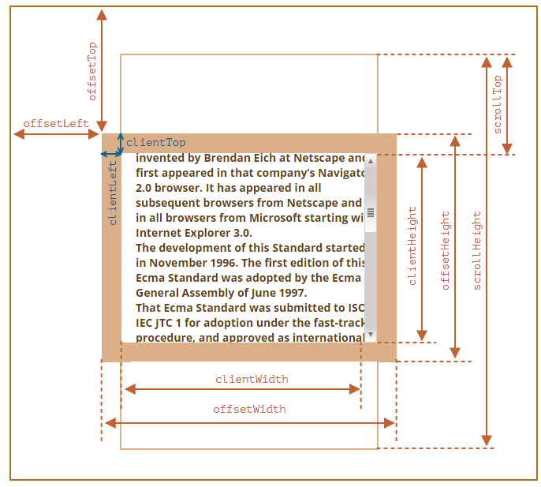

# Javscript
## 자바스크립트란?
: 웹 페이지를 사용자의 액션에 반응하여 페이지를 동적으로 꾸며주는 역할을 하는 프로그래밍 언어.

1) javascript
2) JQuery
3) Ajax
4) (1차 미니 프로젝트)

# 자바스크립트의 특징
  - 객체 지향 프로그래밍 언어
  - 이벤트 관점 프로그래밍
  - 인터프린터 방식의 언어 (컴파일이 아닌 한줄 한줄씩 해석, 실행한다.)
   - C-family 언어이다.

# 1. 기본

# Javascript에서 화면에 출력하는 4가지 방법
<pre>
1. document.write()
2. window.alert()
3. console.log()
4. document.getElement ~
</pre>

## JS 공부법.
 - 문법을 익힌다. (외운다)
 - 알고리즘 (문제해결능력)


# 2. 변수와 상수
- 변수(variable) : 변할 수 있는 데이터를 저장하는 공간.
<br> let 키워드를 이용해서 선언하고, 재할당이 가능하다.<br>
- 상수(constant) : 값이 변하지 않는 데이터를 저장하는 공간.<br>
const 키워드를 이용해서 선언하고, 재할당이 불가능하다.

## 변수 및 상수 명명 규칙
- 첫 글자는 반드시 영문자 | $ | _ 로 시작한다.
- 변수나 상수 이름은 가급적 의미있게 만든다.
- 변수는 소문자로 시작하고 카멜 표기법을 준수한다.
- 상수는 대문자만으로 선언한다. (2단어 이상 결합하는 경우 언더바를 사용하여 선언한다.)
- 영문자는 대소문자를 구분한다.
- 예약어(let, const, var 등)키워드는 변수 또는 상수명으로 사용할 수 없다.

## 프로그래밍 표기법
1. Camel Case(카멜 표기법) : 첫 문자를 소문자로 시작해서, 이후 단어에 첫 글자는 대문자로 표기 phoneNumberAddress 
2. Pascal Case(파스칼) : 첫 문자를 대문자로 시작해서, 이후 단어에 첫 글자는 대문자로 표기.
(java의 class명)

3. Kebab(케밥) : 소문자로 표현하고 단어와 단어 사이에 하이픈(-)으로 표기한다.
4. SnakeCase(스네이크): 소문자나 대문자로 표현하고, 단어와 단어 사이에 언더바 연결하여 표기한다.

# 3. 데이터 타입
```html

```

# 4. 연산자
연산자 우선순위
```html
<!DOCTYPE html>
<html lang="ko">
<head>
  <meta charset="UTF-8">
  <meta name="viewport" content="width=device-width, initial-scale=1.0">
  <title>연산자의 종류</title>
  <script>
    // 산술 연산자 (+, -, *, /, %, **(제곱))
    let a = 3, b = 5;
    console.log(b % a); // (나머지 연산) 5 / 3 = 몫 1, 나머지 2 출력 : 2
    console.log(a * b - a);
    console.log(b ** a); // 5^3 5의3제곱 125
    console.log(b ** (a ** 2)); // 거듭제곱은 우결합성으로, 우측의 연산자부터 계산한다.
    console.log((b ** a) ** 2);
    //증감 연산자
    // 연산자의 위치에 따라서 우선순위가 달라진다.
    // 전치연산 : 선증감 후 대입 (연산자가 변수 앞에 있을 때)
    // 후치연산 : 선대입 후 증감 (연산자가 변수 뒤에 있을 때)
    console.log(a); // a = 3
    console.log(a++); // a = 3
    console.log(a); // a = 4
    console.log(++a); // a = 5
    console.log(a) // a = 5

    console.log(b++ * ++a);
    console.log(a, b);

    // 관계 연산자 : 연산의 결과가 true 또는 false가 나오게 하는 연산
    // > (크다) < (작다) >= (크거나 같다) <= (작거나 같다)
    // == (같다), != (같지 않다)
    console.log(a > b); // 6 > 6 => false
    console.log(a == b); // 6 == 6 true
    console.log(a != b); // 6 != 6 false
    console.log(++a == b); // 7 == 6 false
    console.log(b % 2  == 0); // 6 % 2 == 0 true
    
    // 논리 연산자 : 관계연산자와 관계연산자의 조합을 하는 연산자
    // and (&&) : 수식이 모두 참일 때만 결과가 참이 나온다.
    // or (||) : 수식이 둘중 하나가 참일 때만 참이 나온다.
    console.log(a, b); // 7, 6
    console.log(a > b && b != 3);
    console.log(a == 6 && b == 6);

    console.log(a > 2 || b == 6); // true
    console.log(a < 0 || b > 0);  // true
    console.log(a > 0 || b > 0); // true
    console.log(a < 0 || b < 0); // false

    // ! (not)
    // !true -> false, !false -> true
    console.log(!a); //false
    console.log(!0); //true
    
    console.log(a,b);
    console.log(!b>a);
    console.log("123");
    console.log("A" > "a"); // 문자 비교는 ascii코드를 기준으로 비교한다.
    console.log(!!a>b); // (!(!a) ) > b --> (!(false)) > 6 => false
    
    //우선순위 : 증감(후위 a++) > 논리연산자(NOT) > 산술연산자 > 관계연산자 > 논리 (&&, ||) > 대입연산자

    // 대입연산자
    let result = 0;
    result += 3;
    console.log(result); //3
    result *= 2;
    console.log(result); //6
    result /= 2;
    console.log(result); //3
    result %= 2;
    console.log(result); //1

    //==================================================================
    // 위의 연산자들은 꼭 알아두기..

    // 비트연산자 : 2진수로 바꾸어 비트 단위로 연산한다.
    // 비트 & : 
    // 비트 | : 
    a = 5, b = 3;
    // a = 101 = 1 * (2^2) + 0 * (2^1) + 1 * (2^0)
    // b = 011 = 1 * (2^1) + 1 * (2^0)
    // 100001 = 1 * (2^6) + 0 * (2^5) + 0 * (2^4) + 0 * (2^3) + 0 * (2^2) + 0 * (2^1) + 1 + (2^0);
    console.log(`비트 & ${a&b}`); // 1
    console.log(`비트 | ${a|b}`); // 7
    //XOR (exclusive or : 배타or) : 서로 다른 값이 1 같은 값 0
    console.log(`배타 ^ ${a^b}`); // 6
    // 비트 NOT ~ : 1은 0으로, 0은 1로 바꿔서 연산한다.
    console.log(`비트 NOT ${~a}`); // -6

    //쉬프트 연산자 (자리이동 연산자)
    // a << 2 -> a * 2^2 = 20
     //a << 2
     // 0 0 1 0 1
     // 1 0 1 0 0
    console.log(`쉬프트연산자 a<<2 : ${a<<2}`);

    //a >> 2 -> a * 2 ^(-2)
    // 1 0 1
    // 0 0 1  = 1
    console.log(`쉬프트연산자 a<<2 : ${a>>2}`);
  </script>


</head>
<body>
  
</body>
</html>
```

# 우선순위

: 우선순위 : 증감(후위 a++) > 논리연산자(NOT) > 산술연산자 > 관계연산자 > 논리 (&&, ||)

# if문

## 1) 단순 if 블럭
```javascript
if (조건식) {
  참일경우  동작
}
```

## 2) if ~ else 문
```javascript
if(조건식) {
  조건이 참 일경우 수행할 문장
} else {
  조건이 거짓일 때 수행할 문장;
}
```

## 3) if ~ else if ~ else if ~ else 문
```javascript
if(조건식1) {
  조건1이참일때수행;
}else if(조건식2) {
  조건2가참일때수행
}else if(조건식3) {
  조건3이참일때수행
} ... {

} else {
  어떤 조건식 도 참이 아닐경우 수행
}
```

# switch ~ case 문
```javascript
switch(변수) {
  case 값1 :
    // 변수가 값1 일 때 수행할 문장
    break;
  case 값2 :
    // 변수가 값2 일 때 수행할 문장
    break;

    . . .
  case 값n :
    // 변수가 값n일 때 수행할 문장
    break;
  default :
    // 변수가 위의 어느 값도 아닐 때 수행할 문장
    break;
}
```

예제)<br>
1. 오늘 뭐 먹지 코드의 if문을 switch case로 바꿔보세요.
2. 가위바위보 게임 만들기.

## 전역(Global) 변수, 지역(Local) 변수
 - <b>전역변수</b> : <script></script> 태그 내에 어떤 중괄호{} 코드 블럭에도 포함되지 않은 영역에서 선언된 변수이다. 변수가 선언된 위치 이하의 모든 동일한 웹 페이지 내에서 살아 있으며, 유저가 다른 페이지로 이동하거나, 웹 브라우저를 닫을 때까지 메모리에 남아 있게 된다.

  - <b>지역변수</b> : 중괄호{} 코드블럭 안에서 생성된 변수이다. 생성된 코드 블럭 안에서만 생존하며, 중괄호 코드 블럭을 나온 순간 그 변수는 메모리에서 소멸하게 된다.
  - 연습문제)
   사용자에게 키와 몸무게를 입력받아 계산하여 출력하고,
   기준표에 맞춰서 bmi를 분류하여 출력한다.
   - 연습문제2) 유저에게 숫자를 입력받아 홀수이면 홀수 , 짝수이면 짝수라고 출력하는 프로그램을 작성하되 switch~case문을 활용하여 만드세요.

  # 3. 반복문
  : 프로그램에서 정해진 횟수만큼 어떤 명령문을 반복 수행시키던지, 조건식에 따라서 반복 수행 시키던 할 때 사용하는 구문.
  
  ## (1) for문
  ```javascript
for(ⓐ반복인덱스 변수에 초기값 할당; ⓑ조건식; ⓒ증감식) {
  ⓓ// 조건식이 참일 동안 반복수행할 문장
  ...
}

1. 최초 for 블럭에 진입하면 ⓐ 부분이 단 1회 수행된다.
2. ⓑ조건식을 비교하여 참이면 ⓓ가 수행된다.
3. ⓒ증감식을 수행한다.
4. 2번으로 돌아간다.

ex)
for(let i=0; i<=5; i++) {
    5회 반복할 문장
}
  ```

## (2) while 문
: 조건식이 참일 동안에 반복할 문장을 만드는 데 좋다.

```javascript
while문을 반복할 인덱스 변수 초기화;
while(조건식) {
  // 조건식이 참일 동안 반복 수행할 문장들;
  // 증감식 또는 언젠가는 반복문을 빠져나가게 할 조건;
}
```


## (3) do~while 문
: 최초 do 블럭을 한 번 수행한 후, 조건식을 비교하여 조건식이 참이면
```javascript
while문을 반복할 인덱스 변수 초기화;

do {
  // 무조건 한 번 실행한 후 조건식이 참 일 동안 반복된다.
} while(조건식)
```

## (4) 기타반복문
1. continue; 반복문의 다음 횟수로 건너뛰기
2. break; 반복문을 빠져나온다.

# Javascript 03. 배열 (Array)
: 논리적으로 연속된 공간에 하나의 변수 이름으로 여러개의 값을 저장하고 관리하는 자료/메모리구조

## 자바스크립트의 배열:
1) 크기가 가변인 배열
2) 하나의 배열에 여러가지의 데이터 타입 저장이 가능(문자, 정수, 실수, boolean 등)

크기(length)가 5: 요소가 5개인 배열
배열의 ~번째를 요소(index | 첨자) 라고한다.

# JS 04. 함수 (function)
: 자주 사용하는 기능을 모듈화하여 호출해서 재사용할 수 있도록 만든 구조

1) 내장함수 (built-in function)
: 자바스크립트에 미리 만들어져, 프로그래머가 호출하면 언제든지 사용할 수 있는 함수들
2) 사용자(=개발자) 정의 함수 : 개발자의 필요에 따라 자주 사용하게 될 기능을 모듈화 하여 함수로 만들 수 있다.

* 함수의 기본 구조
```javascript
  function 함수이름([ 매개변수1, 매개변수2, .... ]) {
    // 함수가 호출되면 실행될 문장(들)

    [return 반환 값;]
  }

  [ ] : 생략 가능.
```
-> return 값은 함수를 호출한 곳으로 되돌려 주는 값. 반환 값은 하나만 받을 수 있다.

* 함수 호출
```javascript
반환값을 저장할 변수 = 함수명([매개변수1, 매개변수2 ....]);
```

## Array.sort()
```javascript
++++ 숫자를 정렬하는 방법
Array.sort(function(a, b) { // sort function
  return a-b
});

Array.sort((a, b) => return a-b); //arrow function
               ↓↓↓
function compareFunction(a, b) {
  if(a < b) {
    a를 b보다 작은 색인으로 정렬. 즉 a가 먼저온다.
  }else if(a == b) {
    a와 b를 서로에 대해 변경하지 않고 모든 다른 요소에 대해 정렬.
  }else if(a > b) {
    b를 a보다 낮은 인덱스로 sort한다.
  }
};

a-b : 오름차순
b-a : 내림차순

+++++++ 문자열을 정렬하는 방법
sort 메서드에 compareFunction을 적지 않을경우 요소를 문자열로 변환하고, 유니코드 포인트 순서로 문자열을 비교하여 정렬한다.
예) 바나나 -> 체리 
따라서 문자열을 정렬할 때 sort메서드에 비교함수를 넣어주지 않아도된다.
```

## Arrow Function 화살표 함수
ES6 : 반환값이 있는 함수를 단축화해서 표현 <br>
: function 키워드를 생략하고 => 를 사용하여 함수 표현식을 보다 단순하고 간결한 문법으로 함수를 만드는 방법
```javascript
function func(arg1, arg2, ...) {
  return expression;
}

// 매개변수가 여러개일때
let ex = (arg1, arg2, ...) => {
  return expression;
}

// 매개변수가 1개일때
let ex1 = arg1 => expression;

// 실행 문장이 한줄일경우 {중괄호} 생략이 가능하다.
let ex2 = () => {
  return expression;
}

- 만약 {중괄호}가 있다면 return 키워드를 생략할 수 없다.
- 만약 {중괄호}가 없다면 return 키워드가 없어도 expression이 반환된다.

```

## 참고) 배열관련 메소드
```javascript

  <script>
    // every() : 배열의 모든 요소가 제공된 함수를 만족하는지 테스트
    let arr = [1, 2, 3, 4];
    const isValid = arr.every(item => item < 3);
    console.log(isValid);

    // find() : 배열에서 제공된 테스트 함수를 만족하는 첫 인덱스의 값을 반환한다
    // findIndex() : 배열에서 제공된 테스트 함수를 만족하는 첫 인덱스를 반환한다.
    let arr1 = [1, 3, 9, 15, 20];
    const findItem = arr1.find((item) => item > 10);
    console.log(findItem);

    // flat()
    let arr2 = [0,1,2,[3,4]];
    console.log(arr2.flat());

    let arr3 = [0,1,[2,[3,4]]];
    console.log(arr3.flat(2));
    let arr4 = [0,[1,[2,[3,4]]]];
    console.log(arr4.flat(Infinity));

    // includes() : 배열의 항목에 특정 값이 포함되어 있는지를 판단하여 boolean을 반환한다.
    console.log(arr1.includes(3));
    // indexOf() : 특정 값이 포함되어 있는지를 판단하여 있다면 해당 index를, 없으면 -1를 반환한다.
    console.log(arr1.indexOf(3));
    
    if(arr1.indexOf(3)) {
      console.log("2가 없습니다.");
    }else {
      console.log("!")
    }

    // map(), filter() 등
    
  </script>
```


## 내장 함수
: 어떤 객체에도 속하지 않으나, 웹 브라우저의 자바스크립트 실행기에 내장된 함수들


# Javascript 05. 객체 (Object)
객체란?<br>
: 현실 세계의 모든 것. <br>
객체지향 언어 : 현실세계의 모든 것을 프로그래밍 코드로 변환하기 위해 만든 패러다임<br>

- 객체는 속성(객체의 성질을 설명)과 기능(객체가 하는 일을 설명)
- 속성, 기능을 객체의 멤버라고 한다.

## (1) 내장 객체 (built-in object)
1. Date 객체 : 자바스크립트에서 날짜, 시간을 표현하는 객체
2. String 객체

## (2) 사용자 정의 객체
: 프로그래머가 직접 만드는 객체

# JS 06. DOM traversing
DOM (Document Object Model) <br>
: DOM은 웹 문서의 모든 요소를 자바스크립트를 이용해서 조작할 수 있도록 객체를 사용해서 문서를 해석하는 방법 <br>

- DOM Tree


- DOM API (Document Object Model Application Programming Interface)<br>
웹 문서의 동적 변경을 위해 DOM이 자신에 접근하고 수정할 수 있는 방법을 제공하는데, 이를 DOM API라고 부른다.

- event handler
  1) 인라인
  2) property 속성
  3) addEventListener(이벤트, 이벤트핸들러)메서드

# 자바스크립트 주요 내장 객체와 멤버들

1. window : 브라우저 창이 열릴 때 마다 하나씩 만들어지는 객체.

2. location : 사용자 브라우저와 관련된속성과 메서드를 제공하는 객체, 현재 url에 대한 정보(속성)와 새로고침(reload()) 메서드를 제공한다.

3. history : user가 방문했던 페이지 기록을 통해 방문해썯ㄴ 페이지로 다시 이동하도록 돕는다.
  - history.back()
  - history.forward()
  - history.go(-2)
4. navigator : 브라우저 정보


# javascript 요소 사이즈와 스크롤
참고 사이트 : https://ko.javascript.info/size-and-scroll



# JS 07. 이벤트 (event)
웹 브라우저에서 어떤 이벤트( 마우스클릭, 드래그, 키보드입력, 페이지로딩)이 발생하면 자바스크립트를 통해 해당 이벤트를 처리할 수 있다.

## 1. 키보드 관련이벤트
:keydown, keypress, keyup

  - keydown, keypress 차이점:<br>
  keydown은 물리적으로 어떤 키가 눌렸는지에 관심이 있지만, keypress는 실제로 어떤 값이 입력되는지에 관심이 있다.

## 2. 마우스 관련 이벤트
- click <br>
- dbclick <br>
- mousedown <br>
- mouseup <br>
- mousemove <br>
- mouseover <br>
- mouseout <br>
- drag..~ <br>
- focus <br>
- blur <br>

## 3. change
: 값이 바뀔 때 동작하는 이벤트

## 4. 이벤트 버블링 (event bubbling)
: 자식 요소에서 발생한 이벤트가 부모 요소로 전파(propagation)됨을 의미<br>

- event.stopPropagation() : 이벤트 전파 중지시킨다
- addEventListener(이벤트, 핸들러, {capture : true}) : 해당 이벤트를 가장 먼저 동작시킨다.
- event.preventdefault() : default 행동을 멈추게한다 ex) submit , a href

# JS 08. 쿠키(Cookie)
:서버가 클라이언트에 저장하는 텍스트 파일 (4kb, 도메인당 20개 제한)


# JS 09. GET 방식으로 데이터 전달하기
웹은 기본적으로 상태(state)가 보존되지 않는 stateless방식(하나의 웹 페이지가 종료되면 그 페이지에 있던 변수 값은 모두 소멸됨)으로 동작된다.

## 데이터를 전달하는 방식
1. GET
    - 데이터를 URL의 쿼리스트링으로 붙여서 전달한다.<br>
  우리는 필요에 의해 원하는 데이터를 쿼리스트링으로 만들어서 전송할 수도 있어야하고, 쿼리 스트링에서 전송된 데이터를 확인할 수도 있어야 한다.
    - 구현이 간단하다
    - URL의 길이에 제한이 있기 때문에 전달하는 데이터의 크기에 제약이 있다.
    - URL에 데이터가 노출되기 때문에 민감한 데이터를 전달할 수 없다.
2. POST
    - 웹 서버의 BackEnd단에서 전달된 데이터를 확인 가능하다
    - 전달되는 데이터의 패킷의 헤더(header)에 데이터를 전달하는 방식이다.
3. PUT, DELETE
    - REST 방식으로 동작하는 웹 서버에서 구현한다.


