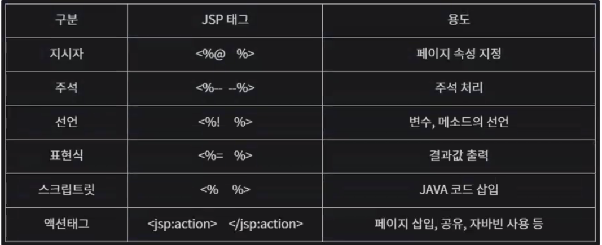

- [JSP 01. 설치 및 개요](#jsp-01-설치-및-개요)

# JSP 01. 설치 및 개요

## 1. jsp 프로그래밍을 하기 위한 설정
  - jdk 설치
  - Eclipse Java EE
  - Apache Tomcat (9버전)

## 2. JSP (Java Server Page)
```
연습문제
jsp에서 삼각형의 밑변과 높이를 입력받아서, 서블릿에서 그 데이터를 받아
삼각형의 넓이를 구하고, 웹 페이지로 삼각형의 밑변, 높이를 출력하는 프로그램을 작성하세요(GET)

2)
유저에게 이름, 아이디, 비밀번호를 입력받아 서블릿을 통해 입력받은 이름, 아이디, 비밀번호를 웹페이지로 출력하는 프로그램을 작성하세요(POST)
```

# JSP 02. JSP 기본 태그
- JSP에서 자바 문법을 사용할 수 있다.
- (목표) 기본 태그는 익히되, 가능하면 사용하지 말자 (MVC 패턴 프로그래밍을 위해)


종류 | 용도
--- | ---
page | 해당jsp 페이지의 전반적인 환경 설정
include | 현재 페이지에 다른 파일을 포함시킨다.
taglib | 태그 라이브러리에서 태그를 꺼내와 사용할 수 있도록 선언

## (1) page 지시자
: jsp 페이지에 대한 정보 설정 ex.문서의 타입, 에러 페이지 mime 타입과 같은 정보 등


# Servlet Filter

## 1. web.xml 방식
ServletFilter.java
```JAVA
package com.jspbasic;

import java.io.IOException;

import javax.servlet.Filter;
import javax.servlet.FilterChain;
import javax.servlet.FilterConfig;
import javax.servlet.ServletException;
import javax.servlet.ServletRequest;
import javax.servlet.ServletResponse;

public class ServletFilter implements Filter{
	
	@Override
	public void doFilter(ServletRequest request, ServletResponse response, FilterChain chain)
			throws IOException, ServletException {
		request.setCharacterEncoding("UTF-8");
		response.setContentType("text/html; charset=utf-8");
		System.out.println("Encoding Filter running.. ");
		chain.doFilter(request, response);
	}

}

```
web.xml
```xml
  <filter>
  	<filter-name>EncodingFilter</filter-name>
    <!-- 클래스 경로 -->
  	<filter-class>com.jspbasic.ServletFilter</filter-class>
  </filter>
  <filter-mapping>
  	<filter-name>EncodingFilter</filter-name>
  	<url-pattern>/*</url-pattern>
  </filter-mapping>
```
## 2. Annotation 방식
```JAVA
package com.jspbasic;

import java.io.IOException;

import javax.servlet.Filter;
import javax.servlet.FilterChain;
import javax.servlet.ServletException;
import javax.servlet.ServletRequest;
import javax.servlet.ServletResponse;
import javax.servlet.annotation.WebFilter;
import javax.servlet.annotation.WebInitParam;

@WebFilter(
	value= {"/*"},
	initParams=@WebInitParam(name="encoding", value="UTF-8")
)
public class ServletFilterAnnotation implements Filter {

	@Override
	public void doFilter(ServletRequest request, ServletResponse response, FilterChain chain)
			throws IOException, ServletException {
		request.setCharacterEncoding("UTF-8");
		response.setContentType("text/html; charset=utf-8");
		
		chain.doFilter(request, response);
	}

}

```

# JSP 03. 내장객체 (Implicit Object)
- JSP에서 사용자가 객체를 생성하지 않아도, 이미 생성되어 사용할 수 있는 객체를 의미한다.
- 
