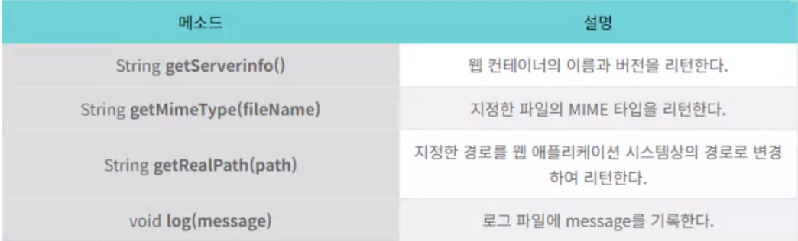

- [JSP 01. 설치 및 개요](#jsp-01-설치-및-개요)

# JSP 01. 설치 및 개요

## 1. jsp 프로그래밍을 하기 위한 설정
  - jdk 설치
  - Eclipse Java EE
  - Apache Tomcat (9버전)

## 2. JSP (Java Server Page)
```
연습문제
jsp에서 삼각형의 밑변과 높이를 입력받아서, 서블릿에서 그 데이터를 받아
삼각형의 넓이를 구하고, 웹 페이지로 삼각형의 밑변, 높이를 출력하는 프로그램을 작성하세요(GET)

2)
유저에게 이름, 아이디, 비밀번호를 입력받아 서블릿을 통해 입력받은 이름, 아이디, 비밀번호를 웹페이지로 출력하는 프로그램을 작성하세요(POST)
```

# JSP 02. JSP 기본 태그
- JSP에서 자바 문법을 사용할 수 있다.
- (목표) 기본 태그는 익히되, 가능하면 사용하지 말자 (MVC 패턴 프로그래밍을 위해)


종류 | 용도
--- | ---
page | 해당jsp 페이지의 전반적인 환경 설정
include | 현재 페이지에 다른 파일을 포함시킨다.
taglib | 태그 라이브러리에서 태그를 꺼내와 사용할 수 있도록 선언

## (1) page 지시자
: jsp 페이지에 대한 정보 설정 ex.문서의 타입, 에러 페이지 mime 타입과 같은 정보 등


# Servlet Filter

## 1. web.xml 방식
ServletFilter.java
```JAVA
package com.jspbasic;

import java.io.IOException;

import javax.servlet.Filter;
import javax.servlet.FilterChain;
import javax.servlet.FilterConfig;
import javax.servlet.ServletException;
import javax.servlet.ServletRequest;
import javax.servlet.ServletResponse;

public class ServletFilter implements Filter{
	
	@Override
	public void doFilter(ServletRequest request, ServletResponse response, FilterChain chain)
			throws IOException, ServletException {
		request.setCharacterEncoding("UTF-8");
		response.setContentType("text/html; charset=utf-8");
		System.out.println("Encoding Filter running.. ");
		chain.doFilter(request, response);
	}

}

```
web.xml
```xml
  <filter>
  	<filter-name>EncodingFilter</filter-name>
    <!-- 클래스 경로 -->
  	<filter-class>com.jspbasic.ServletFilter</filter-class>
  </filter>
  <filter-mapping>
  	<filter-name>EncodingFilter</filter-name>
  	<url-pattern>/*</url-pattern>
  </filter-mapping>
```
## 2. Annotation 방식
```JAVA
package com.jspbasic;

import java.io.IOException;

import javax.servlet.Filter;
import javax.servlet.FilterChain;
import javax.servlet.ServletException;
import javax.servlet.ServletRequest;
import javax.servlet.ServletResponse;
import javax.servlet.annotation.WebFilter;
import javax.servlet.annotation.WebInitParam;

@WebFilter(
	value= {"/*"},
	initParams=@WebInitParam(name="encoding", value="UTF-8")
)
public class ServletFilterAnnotation implements Filter {

	@Override
	public void doFilter(ServletRequest request, ServletResponse response, FilterChain chain)
			throws IOException, ServletException {
		request.setCharacterEncoding("UTF-8");
		response.setContentType("text/html; charset=utf-8");
		
		chain.doFilter(request, response);
	}

}

```

# JSP 03. 내장객체 (Implicit Object)
- JSP에서 사용자가 객체를 생성하지 않아도, 이미 생성되어 사용할 수 있는 객체를 의미한다.

# application
: 하나의 웹 어플리케이션을 관리하고 웹 어플리케이션 안에서의 자원을 담고 있는 객체 웹 어플리케이션당 하나만 생성되고 모든 jsp에서 접근 가능하다.
<br>
(웹 어플리에키션 정보, 서버의 정보, 서버의 물리적 경로 등을 얻어오는 데 사용)



# JDBC

## 1. DBCP설정
- tomcat > context.xml <br>
Resource 추가
```xml
    <Resource name="jdbc/AjaxJSP" auth="Container"
              type="javax.sql.DataSource" driverClassName="oracle.jdbc.OracleDriver"
              url="jdbc:oracle:thin:@127.0.0.1:1521:mySID"
              username="hr" password="1234" maxTotal="20" maxIdle="10"
              maxWaitMillis="-1"/>
```

- 내프로젝트/WEB-INF/web.xml
```xml
DB jndi 설정 추가
<resource-ref>
	<description>Oracle Datasource</description>
	<res-ref-name>jdbc/AjaxJSP</res-ref-name>
	<res-type>javax.sql.DataSource</res-type>
	<res-auth>Container</res-auth>
</resource-ref>
```
- JNDI(Java Naming and Directory Interface) 는 디렉터리 서비스에서 제공하는 데이터 및 객체를 발견(discover)하고 참고(lookup) 하기 위한 자바 API다. <br>
(디렉터리 서비스 : 자원을 폴더구조(트리구조)로 만들어서 자원을 빠르게 찾는데 이용)


- WEB-INF/lib

[ojdbc6 추가](AjaxJSP/src/main/webapp/WEB-INF/lib/ojdbc6-11.2.0.4.jar)

- Connection 객체 얻어오기
```JAVA
package com.ajaxjsp.dao;

import java.sql.Connection;
import java.sql.SQLException;

import javax.naming.Context;
import javax.naming.InitialContext;
import javax.naming.NamingException;
import javax.sql.DataSource;

public class DBConnection {
	public static Connection dbConnect() throws NamingException, SQLException {
		Context initContext = new InitialContext();
		Context envContext  = (Context)initContext.lookup("java:/comp/env");
		DataSource ds = (DataSource)envContext.lookup("jdbc/AjaxJSP");
		Connection conn = ds.getConnection();
		System.out.println(conn);
		return conn;
	}
}

```