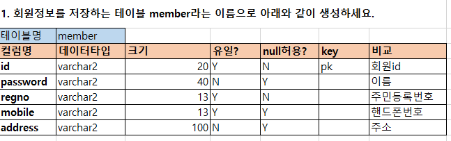

- [DB 01. 설치](#db-01-install-oracle)
- [DB 02. database-개요](#db-02-database-개요)
- [DB 03. JOIN문](#db-03-join)
- [DB 04. sql문의 종류](#db-04-sql문의-종류)
- [DB 05. 제약조건](#db-05-제약조건-constraints)
- [DB 06. 데이터모델링](#db-06-datamodeling)
- [DB 07. 뷰](#db-07-view)
- [DB 08. 시퀀스-인덱스](#db-08-시퀀스--인덱스)
- [DB 09. DCL](#db-09-dcl-data-control-language)
# DB 01. install Oracle

```
개발환경 세팅
version : oracle 11g
workbench : sql developer (JDK11)
```

## 1. oracle installation
<a href="https://www.oracle.com/database/technologies/xe-prior-release-downloads.html"> oracle 11g 버전 다운로드 링크</a><br>
<a href="https://download.oracle.com/otn/java/sqldeveloper/sqldeveloper-23.1.1.345.2114-x64.zip"> SQL Developer 다운로드 링크 (JDK11 포함버전) </a>


## 2. 실습용 HR, scott 계정 언락 및 비밀번호 설정
```SQL
-- hr 계정 잠금 해제
alter user hr account unlock;
-- hr 사용자의 비밀번호를 1234로 설정한다.
alter user hr IDENTIFIED by 1234;

-- 설치된 db 파일내의 scott.sql 파일을 실행 한 후
-- scott 계정의 잠금을 해제해준후 비밀번호를 1234로 설정해준다.
alter user scott account unlock;
alter user scott IDENTIFIED by 1234;
```

# DB 02. Database 개요
## 데이터베이스의 개요
- Database : 유요아게 사용되어질 구조화된 데이터의 집합
- Database Management System (DBMS) <br>
: 방대한 양의 데이터가 있는 데이터베이스를 편리하게 저장하고 효율적으로 관리하며 검색할 수 있도록 하여, 유저가 편하게 데이터베이스를 이용할 수 있도록 하는 환경을 제공해주는 프로그램.<br>
ex. 오라클, MySQL, MSSQL, MariaDB 등
- SQL(Structed query language)<br>
: 데이터베이스를 관리 (<strong>Create(생성), Read(조회), Update(수정), Delte(삭제) , CRUD</strong>)하기 위해서 만들어진 구조화된 질의 언어.

## 왜 데이터를 관리할 때 데이터베이스를 사용할까?
파일로 데이터를 관리하게 될 때 단점
- 특정 데이터를 검색하기 힘듦.
- 공유가 힘듦.
- 보안이 취약하다.
- 응용 프로그래머가 파일에 관한 프로그램을 만들 때, 물리적 구조를 알아야 프로그래밍 할 수 있어 프로그래밍 하기 어렵다.

# DBMS의 장점
- 데이터의 공유가 편리하다.
- 데이터의 중복성이 감소된다.
- 데이터의 불일치가 감소된다.
- 데이터의 무결성을 유지할 수 있다.
- 데이터의 보안을 유지할 수 있다.
- 표준화가 가능하다.

# 데이터베이스의 종류
1. 관계형 데이터베이스 (RDBMS : Realtional Database Management System) <br>
: 테이블(행과 열로 이루어진) 구조로 데이터를 관리하는 데이터베이스.
2. 트리형 데이터베이스
3. 네트워크형 데이터베이스

# 관계형 데이터의 릴레이션 구조

튜플(Tuple)
튜플은 릴레이션을 구성하는 각각의 행을 말하며 속성의 모임으로 구성된다. 파일 구조에서 레코드와 같은 의미이다. 튜플의 수를 카디널리티(Cardinality) 또는 기수, 대응수라고 한다.

 

 

속성(Attribute)
속성은 데이터베이스를 구성하는 가장 작은 논리적 단위이며 개체의 특성을 기술한다. 파일 구조상의 데이터 항목 또는 데이터 필드에 해당한다. 속성의 수를 디그리(Degree) 또는 차수라고 한다.

 

 

도메인(Domain)
도메인은 하나의 속성(attribute)이 취할 수 있는 같은 타입의 원자값들의 집합이다. 도메인은 실제 속성 값이 나타날 때 그 값의 합법 여부를 시스템이 검사하는데에도 이용된다.

 

 

릴레이션의 특징
 - 한 릴레이션에는 똑같은 튜플이 포함될 수 없음

 - 한 릴레이션에 포함된 튜플 사이에는 순서가 없음

 - 튜플들의 삽입, 삭제 등의 작업으로 인해 릴레이션은 시간에 따라 변함

 - 릴레이션 스키마를 구성하는 속성들 간의 순서는 중요하지 않음

 - 속성의 유일한 식별을 위해 속성의 명칭은 유일해야 함

 - 하지만, 속성을 구성하는 값은 동일한 값이 있을 수 있음

 - 릴레이션을 구성하는 튜플을 유일하게 식별하기 위해 속성들의 부분집합을 키로 설정

 - 속성의 값은 논리적으로 더 이상 쪼갤 수 없는 원자값만을 저장

 
 ```SQL
SELECT 연습문제

1. 중복되는 컬럼을 한번씩만 출력하는 키워드는 ( ) 이다.
1-1. 사원테이블의 직무가 한번씩만 출력되도록 sql을 작성하세요

2. 사원테이블의 모든 정보를 출력
3. 사원의 이름, 급여, 입사일 만을 출력
4. 사원들이 어떤 부서에 소속되어 있는지 소속 부서번호를 출력하되
   중복되지 않고 한번씩만 출력
5. emp 테이블 중 부서번호가 10번인 사원의 모든 정보 출력
6. 사원 테이블 중 급여가 2000 미만인 사원의 정보 중에서 사번, 이름, 급여를 출력하세요.
7. 이름이 'miller'인 사람의 사번, 이름, 직급을 출력하세요
8. 커미션이 300 또는 500 또는 1400인 사원의 사번, 이름, 커미션을 출력하세요
   (1) or 연산자 이용
   (2) in 이용
9. 급여가 1500과 2500사이인 사원의 사번, 이름, 급여를 출력하세요
   (1) and 이용
   (2) between 이용
10. 이름에 A를 포함하지 않는 사원의 사번, 이름을 출력하세요.
11. 자신의 직속상관이 없는 사원의 이름, 직급, 직속상관의 사번을 출력
12. 사번, 이름, 급여를 급여가 높은 순으로 출력하세요
13. 입사일이 가장 최근 순으로 사번, 이름, 입사일을 출력하세요
 ```

 # DB 03. JOIN 
 ## 조인의 종류
   1. 조인의 종류
      - Cross Join(교차조인) : 의미없는 조인 단순하게 두개 이상의 테이블을 곱연산 결과를 냄
      - Equi Join(동등 조인) : 조인 대상이 되는 테이블에서 공통적으로 존재하는 컬럼을 연결("=")하여 결과를 생성하는 조인
      - Non-Equi Join(비동등 조인) : 조인할 테이블 사이의 컬럼값이 직접적으로 일치하지 않을 때 사용하는 조인("=" 연산자를 제외한 연산자를 사용한다)
      - Outer Join(외부 조인) : 조인 조건에 만족하지 않는 행들도 나타내기 위해 사용하는 조인
      - Self Join : 하나의 테이블에서 조인을 하여 원하는 데이터를 얻는 조인인
 ## 조인의 조건
   1. primary key (기본키)와 foreign key(외래키)컬럼을 통해 서로 다른 테이블을 연결한다.
   2. where 절을 사용하여 조인조건을 기술한다. 조인조건 갯수 = 테이블의 수-1
   3. 명확성을 위해 컬럼명 앞에 테이블 명 또는 별칭을 기술한다.

## ANSI Join
   - Cross Join
   - Inner Join : Equi join과 동일
      - Join 조건을 where절이 아닌 on 절에 기술한다. (일반 조건은 where절에 기술)
      - using (조인할컬럼명) : 조인이 되는 컬럼명이 동일해야 하고, 조인할 컬럼에 대해서 테이블 별칭을 사용할 수 없음
      - natural join : 조인이 되는 컬럼명은 동일해야 한다. DBMS가알아서 테이블을 살펴보고 동일한 컬럼으로 inner join 진행.
      동일한 컬럼이 2개 이상일 경우 and 연산을 이용해 join한다.
   - Outer Join
      - left outer join, right outer join, full outer join

 ## ERD (Entity Relationship Diagram)
 :Entity(개체 : DB에서 데이터화 하려는 개념 ex. 테이블)


 ### 1) 개념적 ERD


 ### 2) 공학적 ERD
 


# DB 04. SQL문의 종류
   - DDL (Data Definition Language) : 데이터베이스 객체(테이블, 인덱스, 뷰, 시퀀스, 동의어 등)를 생성, 수정, 삭제하는 명령문들
   <br> ex) create, alter, drop, truncate, renameto

   - DCL(Data Control Language) : 데이터베이스를 제어하기 위한 명령문들<br>
   ex) commit (영구히 보존), rollback (되돌리기), savepoint

   - DML (Data Manipulate Language) : 데이터베이스의 데이터를 추가, 수정, 삭제하는 명령문들<br>
   ex) insert into, update set, delete from

## 1. DDL문
   1. Create table로 테이블의 구조를 정의
      ```SQL
         CREATE TABLE 테이블명(
            컬럼명1 데이터타입,
            컬럼명2 데이터타입,
            ...
         )
      ```
   2. alter table 테이블명
      1) add 컬럼명 데이터타입
      2) modify 컬럼명 데이터타입
      3) drop 컬럼명
      4) rename 컬럼명 to 새컬럼명
   3. truncate table
   4. rename 테이블명 to 새테이블명
   5. drop table

## 2. DML
   - insert into 테이블명([컬럼명]) values(. . .);
   - update 테이블명 set 컬럼명 = 값, . . . [where 조건식];
   - delete from 테이블명 [where 조건식];

truncate vs delete
: truncate는 DDL(데이터 정의어)이기 때문에 rollback이 되지않고
delete는 DML문으로 rollback이 가능하다.

## ORACLE 데이터 베이스의 자료형(DATATYPE)
| 이름  | 설명  |
|---|---|
|char(size) |고정길이 문자데이터. 입력된 자료 길이와 상관없이 정해진 길이만큼 저장영역을 차지함. |
|varchar2(size)|최대 4096byte. 가변길이 유니코드 문자(국가별 문자세트) 데이터.|
|date|날짜형식을 저장하기 위해 사용하는 자료형<br>(BC4712 1월1일 ~ AD 4712년 12월31일 까지)|
|nvarchar2(size)|4096byte. 가변길이 유니코드 문자(국가별 문자세트) 데이터|
|number (w,d)|w는 전체길이, d는 소숫점 이하 자릿수. 최대길이 w=38자리|
|blob|최대 크기 4GB의 대용량 이진 데이터를 저장. binary|
|clob|최대 크기 4GB의 대용량 텍스트 데이터를 저장.|


# DB 05. 제약조건 (constraints)
: 데이터가 추가, 수정, 삭제될 때, 데이터의 무결성을 지키기 위해 컬럼 단위로 주어지는 조건

## 제약조건의 종류
종류         |설명 
------------|---------------------------------------------
not null    | null을 허용하지 않는다.
unique      | 중복된 값을 허용하지 않는다. 항상 유일한 값을 가져야 한다.
primary key | not null + unique
foreign key | 참조되는 테이블의 컬럼값이 존재해야 입력할 수 있다.


## 제약조건과 cascade | set null 옵션
: 두 테이블을 연결해서 부모테이블의 행(pk를 가지고 있는 쪽)을 삭제할 때, 그 부모테이블을 참조하는 다른 테이블의 행을 동시에 삭제되도록 하거나 (on delete cascade), 다른 테이블의 행의컬럼을 null로 변경 (on delete set null) 하는 것이다.

```SQL
CREATE TABLE 테이블명(
   컬럼1 데이터타입 1,
   .... ,
   제약조건 on delete cascade | on delete set null
);
```

### 제약조건 연습문제



# DB 06. DataModeling
   
   - 데이터 모델링 : 데이터베이스를 새롭게 구축하기 위한 과정. (사용자의 요구사항을 분석하여 문서화하는 과정)
   - 데이터 모델링 과정
      1) 계획 : 세부 추진일정 수립(간트차트 활용 : 시간을 기준으로 활동(작업)을 표시하는 프로젝트 관리 방법 중 하나. 가로 축: 날짜, 세로축: 프로젝트 수행해야하는 작업(인원, 진행률 등))
         - 인터뷰 계획(현업 담당자와 개발자간의 인터뷰)
         - 자료 수집 계획 (요구 분석 및 입출력 장표 수집)
         - RFP (Request for proposal) : 제안 요청서

      2) 분석 :
         - 수집된 장표와 인터뷰를 바탕으로 비즈니스 로직 분석을 해야 한다.
         - 개념적 데이터 모델링 및 ERD 작성
      
      3) 설계 : 2번 과정에서 만들어진 개념적 ERD를 바탕으로 테이블 명세작성, 물리적 구조 설계 수행
         - 공학적 ERD, 화면 설계서 등 작성
      
      4) 구축 : 3) 과정에서 만들어진 공학적 ERD를 바탕으로 실제 데이터베이스를 개발. 테이블, 뷰, 시퀀스 등의 필요한 객체 개발
      프로그램 코딩 시작

      5) 모듈 개발이 완료 테스트 수행 (단위 테스트)

      6) 전체 모듈 개발 완료 시 통합테스트 수행

      7) 납품 및 유지 보수 일정 

   ## 1. 계획
      - 요구 사항 분석
         case study
      다음은 비디오 관리 시스템 개발을 예로 분석한 분석 결과이다.
      1. 고객이 비디오를 대여 또는 반납하는 작업이 주 업무이다.
      2. 클라이언트는 고객에 대한 고객명, 나이, 주소, 전화번호 등의 정보 관리를 원한다.
      3. 클라이언트는 비디오에 대한 제목, 장르, 대여료, 관람등급, 출시사, 출시일, 대여정보 등의 관리를 원한다.
      4. 특정 고객이 비디오를 빌려간 경우 비디오 테이프의 반납 예정 일자는 대여일로부터 보통 2일 (장르에 따라 달라질 수 있다.)로 계산하고, 대여 상태를 기록하게 된다. 연체되었을 경우는 벌금을 하루에 200원씩 (장르에 따라 다를 수 있다.) 부과한다. 최종 기본 대여료는 2000원 (장르에 따라 다를 수 있다) + 벌금으로 대여 총액을 계산하고 매출로 집계된다. 비디오가 반납되고 회수 되었음을 기록하고, 대여 총액을 기록한다.
      5. 비디오 관리 시스템 개발의 주된 목적은 비디오의 대여 반납을 주 업무로 하여 기간별 매출 총액등을 (클라이언트가) 확인할 수 있도록 하되, 고객관리와 비디오 관리를 부업무로 할 수 있도록 한다.

   ## 2. 분석단계

      2-1 논리적 설계 단계
      : 데이터 모델링은 업무 처리에 필요한 자료와 속성을 기술하고 자료간의 관계를 정의하는 과정. 특정 데이터베이스에 구애되지 않고 골격을 구축하는 작업단계로서, 이 단계에서 모델링 기법이 제공되어야 하는데 가장 일반적으로 사용되는 모델링 기법으로 개체 관계 모델(ERD)이 있다.

      2-2 개체 관계 모델(ERD: Entity Relationship Diagram)
      (1) 개체 (Entity) : 데이터를 표현하고자 하는 단위. 보통 요구사항 명세서에서 명사형으로 표현된다.
      (2) 속성(Attribute) : 개체가 가지는 세부적인 특성 즉 성질, 상태를 의미하는데 개체를 실제적으로 표현하는 데이터이다.

      개념적 ERD작성이 어느 정도 되면, 개념적 ERD가 잘 작성되었는지 확인해 보기 위해 개체의 구체적인 예(인스턴스)를 저장해보는 시뮬레이션 과정을 거치는 것이 좋다.

      (3) 개체간의 관계 표현하기
      개체간의 관계를 표현하기 위해서 아래의 2가지 요소를 고려하여야 한다.
      1) 카디널리티 비율(Cardinality Ratio) : 개체를 이루는 각 값이 관계에 참여할 수 있는 수
      2) 참여 제약 조건 : 개체가 관계를 통해 가지고 있는 수

      2-3 물리적 모델
      : 물리적 설계 목적은 개발에 사용할 데이터베이스를 선정하여 특정 데이터베이스로 구현될 수 있도록 구체적인 설계하는 과정이다. 산출물 테이블 명세서

연습문제.
<br> case study 비디오 관리 대여점 시스템을 구축한다고 가정하여,
필요한 객체(테이블 등)를 설계하고 분담하여 필요한 모든쿼리문을 작성하세요.

```SQL
-- 고객이 회원가입을 한다.

-- 손님이 아바타2 비디오가 있는지 문의한다

-- 클라이언트가 0월 0일까지의매출을 보고싶어한다.
-- 미납금을 보고싶어한다. 등

-- 필수 : 각 테이블의 CRUD 쿼리문 처리
-- 옵션 : 팀원이 3문제씩 만들어서 해당 문제를 처리하는 쿼리문만들기
```

# DB 07. VIEW
   - 하나 이상의 테이블의 데이터를 조회하기 위한 객체
   - 실제 데이터를 저장하는 개념이 아닌, 쿼리문을 저장하고 있는 객체
   - 가상 테이블(VIRTUAL TABLE)이라 부르기도 하고, 테이블과 거의 동일하게 사용한다.

   ## 뷰의 사용 목적
   1) 복잡한 쿼리문을 쉽게 사용할 수 있도록 한다.
   2) 직접적인 테이블 접근(민감한 개인정보 데이터)을 제한 하기 위해서 사용한다.

   ```SQL
   -- 뷰 생성
   CREATE [OR REPLACE] [FORCE | NOFORCE] VIEW 뷰이름
   [(컬럼별칭1, 컬럼별칭2, ...)]
   AS 쿼리문
   [WITH CHECK OPTION]
   [WITH READ ONLY]
   ```
   - CREATE [OR REPLACE] : 뷰를 생성할 때, 기존의 뷰가 없으면 새로운 뷰를 만들 수 있을 뿐 아니라, 기존의 뷰가 존재해도, 삭제하지 않고 새로운 구조의 뷰로 변경(replace)할 수 있다.
   - WITH CHECK OPTION : 해당 뷰를 통해서 볼 수 있는 범위 내에서만 DML이 가능
   - WITH READ ONLY : SELECT만 가능하고 DML문은 사용불가
   - FORCE : 기존의 테이블의 존재 여부에 상관없이, 컴파일 에러를 가지고 뷰를 생성한다. 테이블이 생성되면 뷰가 완성된다.
      noforce : 뷰가 저장할 select문의 기반 테이블이 존재할 경우에만 생성(기본값)

   ## Top-N

   ### rownum
   의사열(pseudo column)이라고 부르는데, 실제 테이블에 존재하지 않고, select절에 의해서 추출되는 데이터에 붙는 순번이다.
   - rownum과 order by를 함께 사용하는 경우 order by절이 가장 마지막에 실행되기 때문에 주의해야 한다.

# DB 08. 시퀀스 / 인덱스
   시퀀스(Sequence): 순차적으로 증가하여 중복된 값이 없도록 만들어 주는 오라클 객체

# DB 09. DCL (Data Control Language)
: 데이터 무결성을 지키기 위해서 트랜잭션 처리
   - 트랜잭션 (transaction) : 데이터베이스에서 데이터를 처리하는 논리적인 작업의 단위
<br>: 계좌이체의 일련의 과정들이 하나의 묶음으로 처리 되어야 한다. 혹시 중간에 무슨 문제가 발생한다면, 진행되던 인출과정을 전체를 취소하고 처음부터 시작해야 하기 때문. ACID - A(원자성) - All or Nothing

   - commit : 데이터베이스에 트랜잭션 작업내용을 영구히 저장한다.
   - rollback : 트랜잭션의 작업 내용을 취소, 이전 commit한 곳까지만 복구
   - savepoint : 하나의 트랜잭션에서 소단위 작업을 저장할 때

   ## 자동 commit이 되는 경우
      - 오라클이 정상 종료될 때
      - DDL (create, alter, drop, truncate, rename)문이 수행된 후.
   
   ## 자동 rollback이 되는 경우
      - 오라클이 비정상 종료되거나 컴퓨터가 shutdown되었을 때

# 2차 프로젝트
